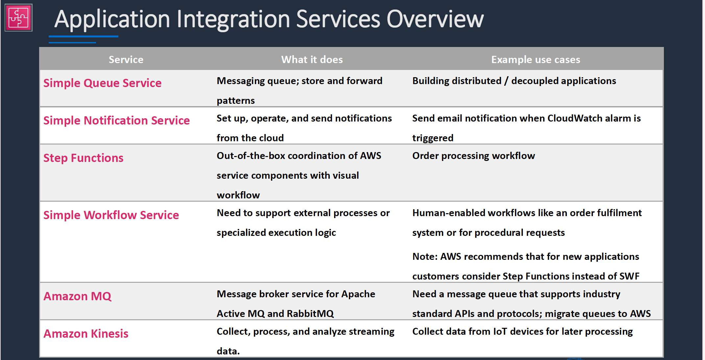
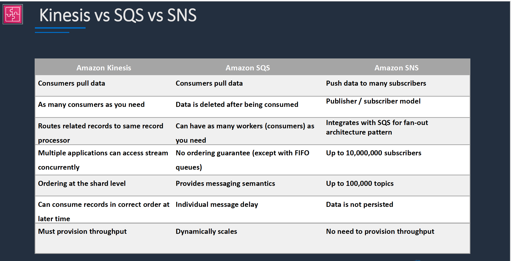
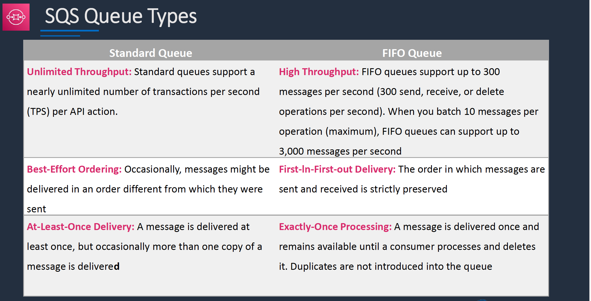

# Section 11: Serverless Applications
## AWS Lambda
__Lambda Function Invocations__  
__Synchronous__:  
* CLI, SDK, API Gateway
* Wait for the function to process the event and return a response
* Error handling happens client side (retries, exponetial backoff etc)

__Asynchronous__:  
* S3 SNS, CloudWatch Events etc
* Event is queued for processing and a response is returned immediately
* Lambda retries up to 3 times
* Processing must be idempotent (due to retried)  

__Event source mapping__:  
* SQS, Kinesis Data Stream, DynamocDB Streams
* lambda does the polling (pools the source)
* Records are processed in order (except for SQS standard)

## Application Integration Services
__Application Integration Service Overview__  

__Kinesis Vs SQS Vs SNS__  

## Amazon SQS
__SQS Queue Types__  

* FIFO queues require the _Message Group ID_ and _Message Deduplication ID_ parameters to be added to messages

* __Message Group ID__:  
  - The tag that specifies that a message belongs to a specific message group. Messages that belong to the same message group are guaranteed to be processed in a FIFO manner
* __Message Deduplication ID__:  
  - The token used for deduplication of messages within the deduplication interval

__SQS Long Polling vs Short Polling__  
* SQS _Long polling_ is a way to retrieve messages from SQS queues – waits for messages to arrive
* SQS _Short polling_ returns immediately (even if the message queue is empty)
* SQS Long polling can lower costs
* SQS Long polling can be enabled at the queue level or at the API level using _WaitTimeSeconds_
* SQS Long polling is in effect when the Receive Message Wait Time is a value greater than 0 seconds and up to 20 seconds

## Amazon SNS
