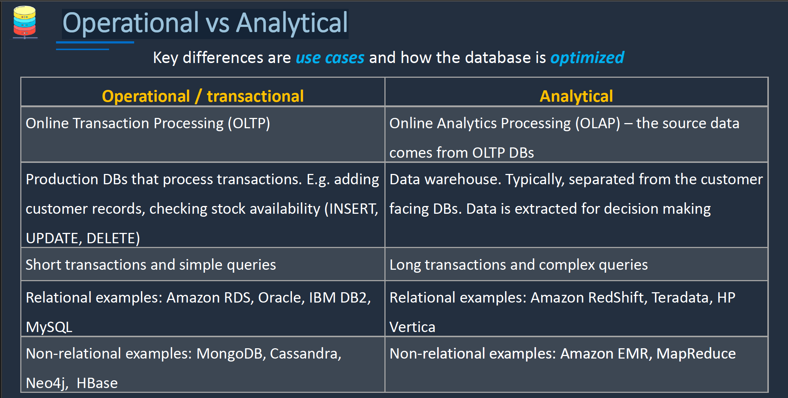
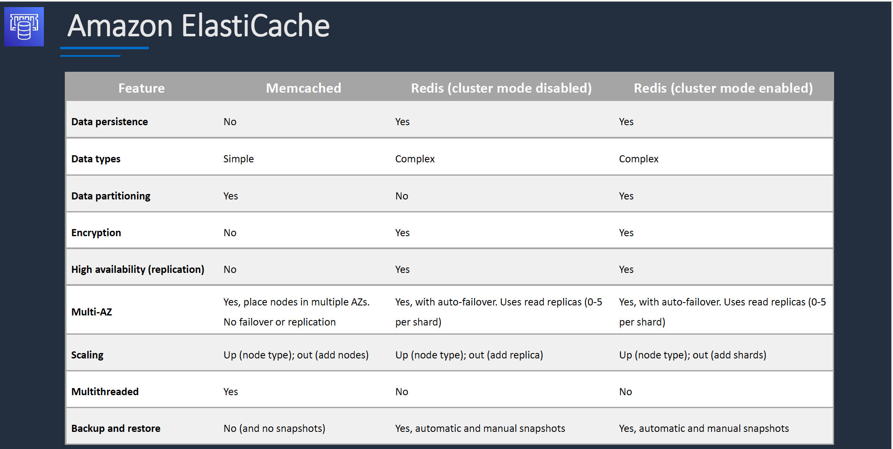
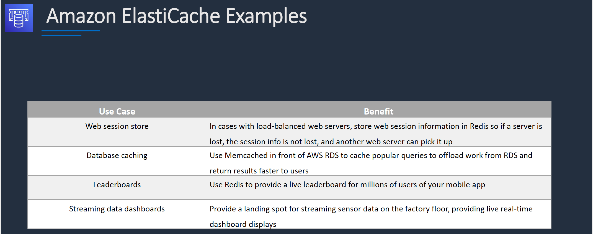
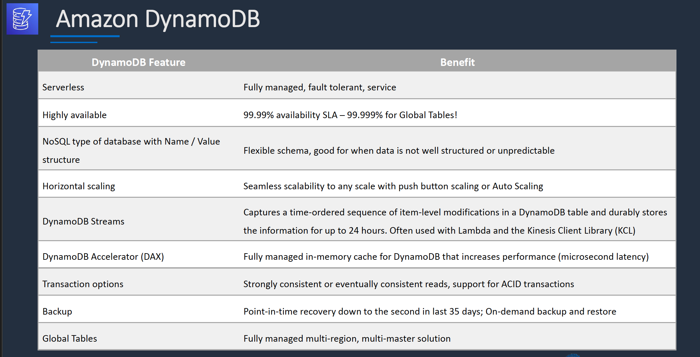
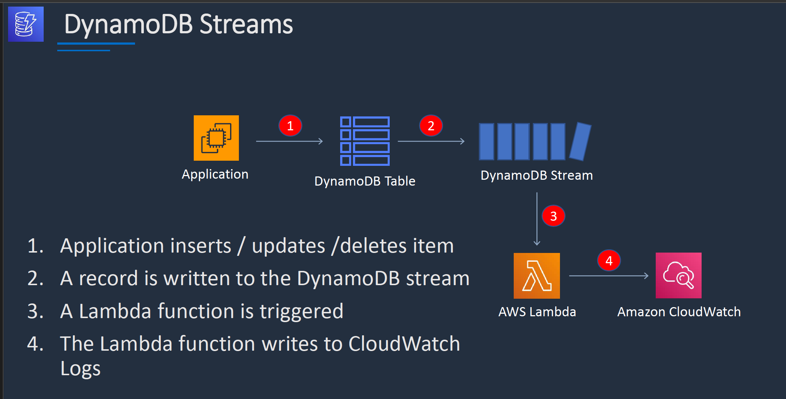
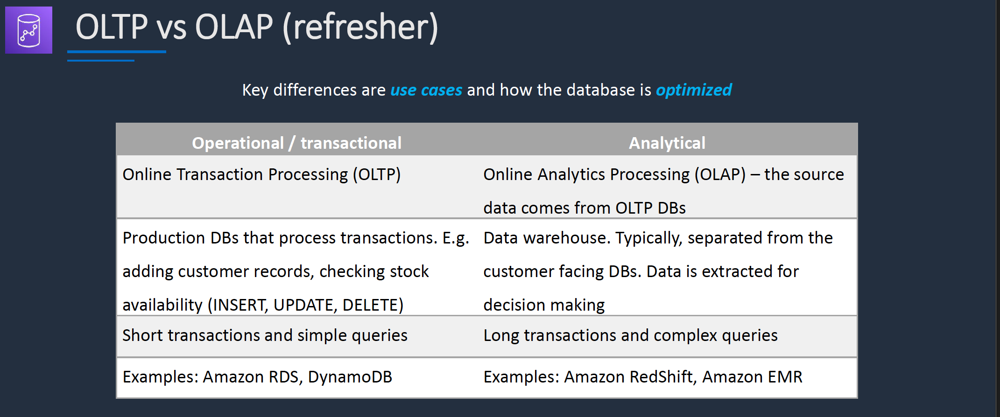

# Section 12: Database and Analytics

## Graph Databases
Graph databases like _Amazon Neptune_ are designed to store, manage, and navigate relationships in data.  
Graph databases use:
* __Nodes__ to represent entities
* __Edges__ to represent relationships
* __Properties__ to store information about nodes and edges

__Operational vs Analytical__   

## Amazon RDS
RDS uses Amazon EBS volumes for storage.  
Backups can be taken using EBS snapshots.   

__Amazon RDS – Scaling up (vertically)__  
RDS scales up by changing the instance type.  
Scaling up is required for better write performance.  
The database must shut down and restart.  

__Amazon RDS – Scaling out (horizontally)__  
RDS scales reads horizontally with Read Replicas.  
Reads can be directed to the Read Replica.  
Applications write to the primary instance.  

__Amazon RDS Multi AZ__  
* Multi-AZ deployments enable automatic _disaster recovery (DR)_.  
* Multi-AZ standby instances are in a different AZ to the primary. They are keep up to date using _Synchronous replication_.  
* Read Replicas can be in the same or a different AZ. They are keep up to date using _Asynchronous replication_.  

__Amazon RDS Automated Backups__  
* __Backup window__: You select the period you want automated backup of the database to be created by Amazon RDS   
* A snapshot is automatically created with retention of 0-35 days.  

__Amazon RDS Manual Backups (Snapshot)__   
* Backs up the entire DB instance, not just individual databases
* For single-AZ DB instances there is a brief suspension of I/O
* For Multi-AZ SQL Server, I/O activity is briefly suspended on primary
* For Multi-AZ MariaDB, MySQL, Oracle and PostgreSQL the snapshot is taken from the standby
* Snapshots do not expire (no retention period)

__Amazon RDS Maintenance Windows__  
* Operating system and DB patching can require taking the database offline
* These tasks take place during a maintenance window
* By default a weekly maintenance window is configured
* You can choose your own maintenance window

## Amazon Aurora
__Introduction__  
* Amazon Aurora is up to five times faster then standard MySQL database and three times faster than standard PostgreSQL
* Amazon Aurora features a distributed, fault-tolerant self-healing storage system that auto-scaled up to 128TB per database instance

__Aurora Fault Tolerance and Aurora Replicas__  
Aurora Fault Tolerance
* Fault tolerance across 3 AZs
* Single logical volume
* Aurora Replicas scale-out read requests
* Up to 15 Aurora Replicas with sub-10ms replica lag
* Aurora Replicas are independent endpoints
* Can promote Aurora Replica to be a new primary or create new primary
* Set priority (tiers) on Aurora Replicas to control order of promotion
* Can use Auto Scaling to add replicas

__Aurora Multi-Master__  
Aurora Multi-Master
* All nodes allow reads/writes
* Available for MySQL only
* Up to four read/write nodes
* Single Region only
* Cannot have cross-Region replicas
* Can work with active-active and active-passive workloads
* Can restart read/write DB instance without impacting other instances

__Aurora Serverless Use Cases__  
* Infrequently used applications
* New applications
* Variable workloads
* Unpredictable workloads
* Development and test databases
* Multi-tenant applications

__Amazon RDS Proxy__  
* RDS Proxy is a fully managed database proxy for RDS
* Highly available across multiple AZs
* Increases scalability, fault tolerance, and security

__RDS Proxy Connection Pool__  
* Reduces stress on CPU/MEM
* Shares infrequently used connections
* Drives increased efficiency
* High availability with failover
* Control authentication methods

## Amazon ElastiCache
__Introduction__  
* Fully managed implementations Redis and Memcached
* ElastiCache is a key/value store
* In-memory database offering high performance and low latency
* Can be put in front of databases such as RDS and DynamoDB
* ElastiCache nodes run on Amazon EC2 instances, so you must choose an instance family/type

__ElastiCache Features - MemCached vs Redis__  
  

__Amazon ElastiCache Use Cases__  
* Data that is relatively _static_ and _frequently accessed_
* Applications that are tolerant of stale data
* Data is slow and expensive to get compared to cache retrieval
* Require push-button scalability for memory, writes and reads
* Often used for storing session state

__ElastiCache Example Use cases__   
   

__Amazon ElasticCache - Scalability__  
MemCached
* Add nodes to a cluster
* Scale vertically (node type) - must create a _new cluster_ manually

Redis
* Cluster mode _disabled_:
  - Add replica or change node type - creates a new cluster and migrates data
* Cluster mode _enabled_:
  - Online resharding to add or remove shards; vertical scaling to change node type
  - Offline resharding to add or remove shards change node type or upgrade engine (more flexible than online)

## Amazon DynamoDB
__Introduction__  
* Fully managed NoSQL database service
* Key/value store and document store
* Push button scaling (meaning no downtime required to scale up)

__Dynamo DB Attributes__  
* DynamoDB is made up of:
  - Tables
  - Items
  - Attributes

__DynamoDB Time to Live (TTL)__  
* TTL lets your define when items in a table expires so that they can be automatically deleted from the database
* With TTL enabled on a table, you can set a timestamp for deletion on a per-item basis
* No extra cost and does not use WCU / RCU (Write Capacity Unit/Read Capacity Unit)
* Helps reduce storage and manage the table size over time

__DynamoDB Features__  

__DynamoDB Streams__

* Captures a _time-ordered_ sequence of _item-level_ modifications in any DynamoDB table and stores this information in a log for up to _24 hours_.  
* Can configure the information that is written to the stream:
  - _KEY_ONLY_ - Only the key attributes of the modified item
  - _NEW_IMAGE_ - The entire item, as it appears after it was modified
  - _OLD_IMAGE_ - The entire items, as it appears before it was modified
  - _NEW_AND_OLD_IMAGES_ - Both the new and the old images of the item.

__DynamoDB Accelerator (DAX)__  
* DAX is a fully maanged, highly available, _in-memory_ cache for DynamoDB
* Improves performance from milliseconds to microseconds
* Can be _read-through cache_ and a _write-through cache_
* Used to improve _READ_ and _WRITE_ performance
* You do not need to modify application logic, since DAX is compatible with existing DynamoDB API calls

__DAX vs ElastiCache__  
* DAX is optimized for DynamoDB
* With ElastiCache you have more management overhead (e.g. invalidation)
* With ElastiCache you need to modify application code to point to cache
* ElastiCache supports more datastores so it can be used in front of other Databases

__DynamoDB Global Tables__  
* Here we have DynamoDB table in multiple regions
* We are able to read and write to all the table in all the regions
* The replication of the table from one region to another is _asynchronous_ and it relies on _DynamoDB Streams_
* Global tables are _multi-region_ and _multi-active_ (also know as _multi-master_) database
* With _multi-master_ you can write to or read from any of the tables in any of the regions.  

## Amazon RedShift
__Introduction__  
* Amazon Redshift is a fast, fully manages data warehouse
* Analyze data using standard SQL and existing Business Intelligence (BI)
* RedShift is a SQL based data warehouse used for analytics applications
* RedShift is a relational database that is used for Online Analytics Processing (OLAP) use cases
* RedShift uses Amazon EC2 instances, so you must choose an instance family/type
* RedShift always keeps three copies of your data
* RedShift provides continuous/incremental backups

__OLTP vs OLAP (refresher)__
  

__RedShift Use Cases__
* Perform _complex queries_ on massive collection of _structured_ and _semi-structured_ data and get fast performance
* Frequently accessed data that needs a consistent, highly structured format
* Use _Spectrum_ for direct access of _S3 objects_ in a data lake
* Managed data warehouse solution with:
  - Automated provisioning, configuration and patching
  - Data durability with continuous backup to S3
  - Scales with simple API call
  - Exabyte scale query capability

## Amazon Elastic Map Reduce (EMR)
__Introduction__  
* Managed cluster platform that simplifies running big data frameworks including _Apache Hadoop_ and _Apache Spark_
* Used for processing data for analytics and business intelligence
* Can also be used for transforming and moving large amounts of data
* Performs extract, transform, and load (ETL) functions

## Amazon Athena
__Introduction__  
* Athena queries data in S3 using SQL
* Can be connected to other data sources with Lambda
* Data can be in CSV, TSV, JSON, Parquet and ORC formats
* Uses a managed Data Catalog (AWS Glue) to store information and schemas about the databases and tables

__Optimizing Athena for Performance__  
* Partition your data
* Bucket your data – bucket the data within a single partition
* Use Compression – AWS recommend using either Apache Parquet or Apache ORC
* Optimize file sizes
* Optimize columnar data store generation – Apache Parquet and Apache ORC are popular columnar data stores
* Optimize ORDER BY and Optimize GROUP BY
* Use approximate functions
* Only include the columns that you need

__AWS Glue__
* Fully managed extract, transform and load (ETL) service
* Used for preparing data for analytics
* AWS Glue runs the ETL jobs on a fully managed, scale-out Apache Spark environment
* AWS Glue discovers data and stores the associated metadata (e.g. table definition and schema) in the AWS Glue Data Catalog
* Works with data lakes (e.g. data on S3), data warehouses (including RedShift), and data stores (including RDS or EC2 databases)

## Amazon OpenSearch serviceEventDetails
__Introduction__  
* Distributed search and analytics suite
* Based on popular open source Elasticsearch
* Supports queries using SQL syntax
* Integrates with open-source tools
* Not a Serverless service, is backed up by EC2 instances
* Scale by adding or removing instances
* Availability in up to three Availability Zones
* Backup using snapshots
* Encryption as-rest and in-transit

__OpenSearch Service Deployment__  
* Clusters are created (Management Console, API or CLI)
* Clusters are also known as OpenSearch Service domains  
* You specify the number of instances and instance types
* Storage options include UltraWarm or Cold storage

### Cheat Sheets  
[Amazon RDS Cheat Sheet](https://digitalcloud.training/amazon-rds/)  
[Amazon Aurora Cheat Sheet](https://digitalcloud.training/amazon-aurora/)  
[Amazon DynamoDB Cheat Sheet](https://digitalcloud.training/amazon-dynamodb/)  
[Amazon ElastiCache Cheat Sheet](https://digitalcloud.training/amazon-elasticache/)  
[Amazon RedShift Cheat Sheet](https://digitalcloud.training/amazon-redshift/)  
[Amazon EMR Cheat Sheet](https://digitalcloud.training/amazon-emr/)   
[Amazon Kinesis Cheat Sheet](https://digitalcloud.training/amazon-kinesis/)  
[Amazon Athena Cheat Sheet](https://digitalcloud.training/amazon-athena/)  
[AWS Glue Cheat Sheet](https://digitalcloud.training/aws-glue/)  
