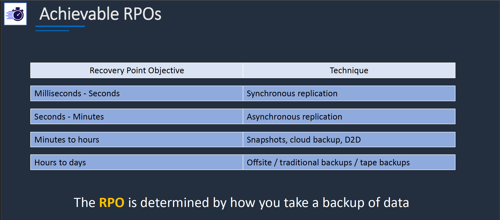
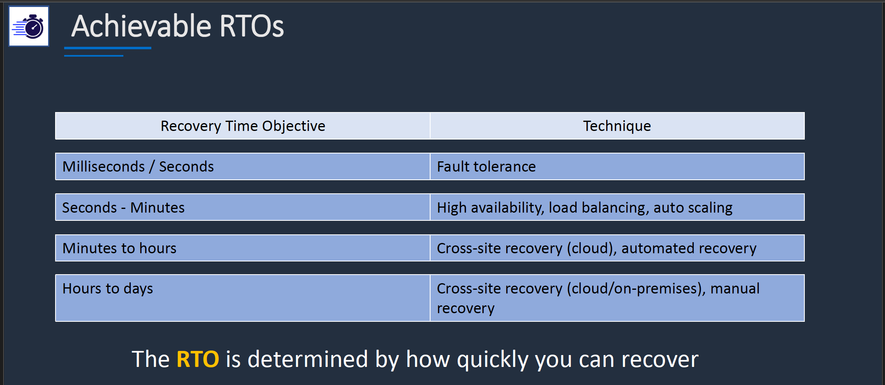
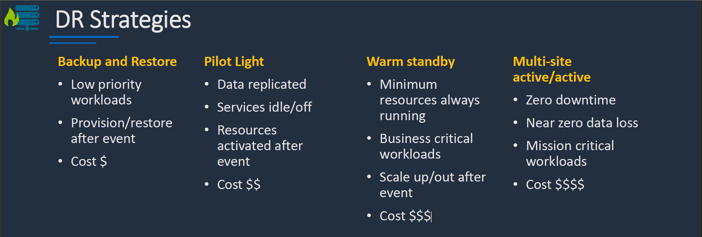

# Section 13: Deployment and Management
## RPO, RTO, and DR Strategies

#### RPO and RTO
__Recovery Point Objective (RPO)__  
* Measurement of the amount of data that can be acceptably lost
* Measured in seconds, minutes, or hours
* Example:
  - You can acceptably lose 2 hours of data in a database (2hr RPO)
  - This means backups must be taken every 2 hours

__Recovery Time Objective (RTO)__  
* Measurement of the amount of time it takes to restore after a disaster event
* Measured in seconds, minutes, or hours
* Example:
  - The IT department expect it to take 4 hours to bring applications online after a disaster
  - This would be an RTO of 4 hours

__RPO Techniques__  

__RTO Techiniques__  
  

__DR Strategies__  
  

### Cheat Sheets  
[AWS CloudFormation Cheat Sheet](https://digitalcloud.training/aws-cloudformation/)    
[AWS Elastic Beanstalk Cheat Sheet](https://digitalcloud.training/aws-elastic-beanstalk/)  
[AWS Config Cheat Sheet](https://digitalcloud.training/aws-config/)  
[AWS RAM Cheat Sheet](https://digitalcloud.training/aws-resource-access-manager/)  
[AWS Systems Manager Cheat Sheet](https://digitalcloud.training/aws-systems-manager/)   
[AWS OpsWorks Cheat Sheet](https://digitalcloud.training/aws-opsworks/)  
