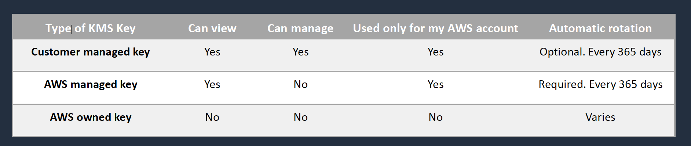
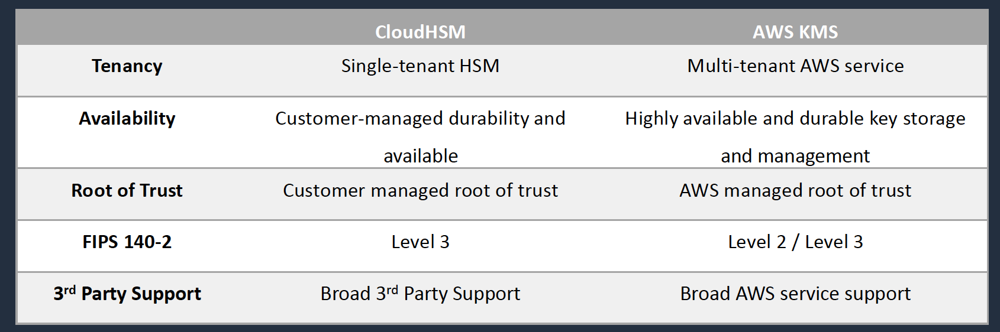
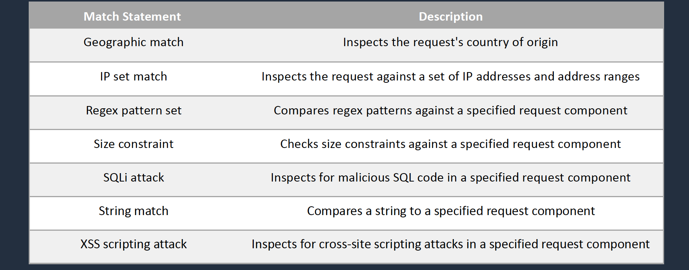
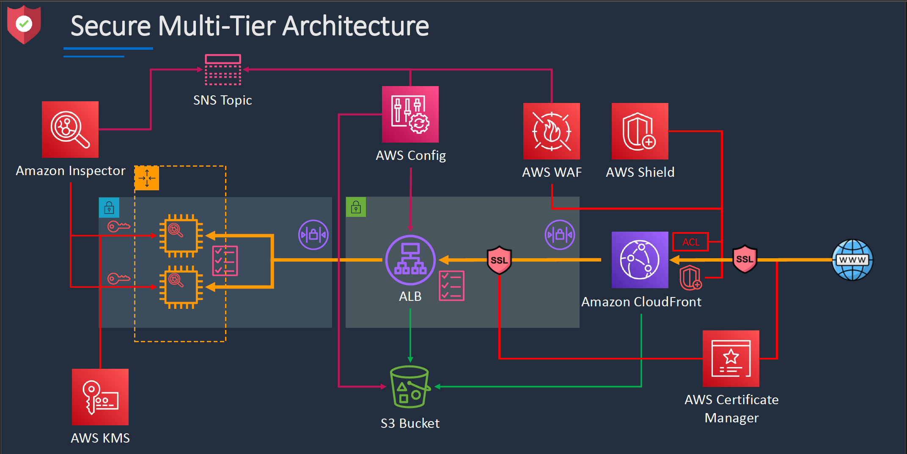

# Section 15: Security in the Cloud
## AWS Key Management Service (KMS)
__Introduction__  
* Create and managed symmetric and asymmetric encryption keys
* The KMS keys are protected by hardware security modules (HSMs)

__KMS Keys__
* KMS keys are the primary resources in AWS KMS
* Used to be known as “customer master keys” or CMKs
* The KMS key also contains the key material used to encrypt and decrypt data
* By default, AWS KMS creates the key material for a KMS key
* You can also import your own key material
* A KMS key can encrypt data up to 4KB in size
* A KMS key can generate, encrypt and decrypt Data Encryption Keys (DEKs)

#### Alternative Key Stores
__External Key Store__
* Keys can be stored outside of AWS to meet regulatory requirements
* You can create a KMS key in an AWS KMS external key store (XKS)
* All keys are generated and stored in an external key manager
* When using an XKS, key material never leaves your HSM
__Custom Key Store__  
* You can create KMS keys in an AWS CloudHSM custom key store
* All keys are generated and stored in an AWS CloudHSM cluster that you own and manage
* Cryptographic operations are performed solely in the AWS CloudHSM cluster you own and manage
* Custom key stores are not available for asymmetric KMS keys

__AWS Managed KMS Keys__
* Created, managed, and used on your behalf by an AWS service that is integrated with AWS KMS
* You cannot manage these KMS keys, rotate them, or change their key policies
* You also cannot use AWS managed KMS keys in cryptographic operations directly; the service that creates them uses them on your behalf

__Data Encryption Keys__  
* Data keys are encryption keys that you can use to encrypt
large amounts of data
* You can use AWS KMS keys to generate, encrypt, and
decrypt data keys
* AWS KMS does not store, manage, or track your data keys,
or perform cryptographic operations with data keys
* You must use and manage data keys outside of AWS KMS

__KMS Keys and Automatic Rotation__   

* You cannot enable or disable key rotation for AWS owned keys
* Automatic key rotation is supported only on symmetric encryption KMS keys with key material that AWS KMS generates (Origin = AWS_KMS)
* Automatic rotation generates new key material every year
* Rotation only changes the _key material_ used for encryption, the KMS key remains the same

#### KMS Keys and Automatic Rotation
__With automatic key rotation:__  
* The properties of the KMS key, including its key ID, key ARN, region, policies, and
permissions, do not change when the key is rotated
* You do not need to change applications or aliases that refer to the key ID or key ARN of the KMS key
* After you enable key rotation, AWS KMS rotates the KMS key automatically every
year
__Automatic key rotation is not supported on the following types of KMS keys:__
* Asymmetric KMS keys
* HMAC KMS keys
* KMS keys in custom key stores
* KMS keys with imported key material

__Manual Rotation__  
* Manual rotation is creating a new KMS key with a different key ID
* You must then update your applications with the new key ID
* You can use an alias to represent a KMS key so you don’t need to modify your
application code
* The alias is associated with the new KMS key

__KMS Key Policies__  
* Key policies define management and usage permissions for KMS
keys
* Multiple policy statements can be combined to specify separate administrative and usage permissions
* Permissions can be specified for delegating use of the key to AWS services
* Grants are useful for _temporary permissions_ as they can be used without modifying key policies or IAM policies

__Additional Exam Tips__  
* To share snapshots with another account you must specify _Decrypt_ and _CreateGrant_ permissions
* The _kms:ViaService_ condition key can be used to limit key usage to specific AWS services e.g
```json
"Conditions": {
  "StringEquals": {
    "kms:ViaService": [
      "ec2.eu-west-2.amazonaws.com",
      "rds.eu-west-2.amazonaws.com"
    ]
  }
}
```
* Cryptographic erasure means removing the ability to decrypt data and can be achieved when using imported key material and deleting that key material
* You must use the `DeleteImportedKeyMaterial` API to remove the key material
* An InvalidKeyId exception when using SSM Parameter Store indicates the KMS key is not enabled
* Make sure you know the differences between AWS managed and customer managed KMS keys and automatic vs manual rotation

## AWS CloudHSM
__Introduction__  
* AWS CloudHSM is a cloud-based hardware security module (HSM)
* Generate and use your own encryption keys on the AWS Cloud
* CloudHSM runs in your Amazon VPC
* Uses _FIPS 140-2_ level 3 validated HSMs
* Managed service and automatically scales
* Retain control of your encryption keys - you control access (and AWS has no visibility of your encryption keys)

__AWS CloudHSM Use Cases__  
* Offload SSL/TLS processing from web servers
* Protect private keys for an issuing certificate authority (CA)
* Store the master key for Oracle DB Transparent Data Encryption
* Custom key store for AWS KMS – retain control of the HSM that protects the master keys

__AWS CloudHSM vs KMS__  


## AWS Web Application Firewall (WAF)
__Introduction__  
* AWS WAF is a web application firewall
* WAF lets you create rules to filter web traffic based on conditions that include IP addresses, HTTP headers and body, or custom URIs
* WAF makes it easy to create rules that block common web exploits like SQL injection and cross site scripting
* AWS WAF is applicable to ALB, Cloud Distribution and API Gateway resources

__WAF Concepts__  
* __Web ACLs__ – You use a web access control list (ACL) to protect a set of AWS resources
* __Rules__ – Each rule contains a statement that defines the inspection criteria, and an action to take if a web request meets the criteria
* __Rule groups__ – You can use rules individually or in reusable rule groups
* __IP Sets__ - An IP set provides a collection of IP addresses and IP address ranges that you want to use together in a rule statement
* __Regex pattern set__ - A regex pattern set provides a collection of regular expressions that you want to use together in a rule statement

__WAF Rule Actions__   
A _rule action_ tells AWS WAF what to do with a web request when it matches the criteria defined in the rule:
* __Count__ – AWS WAF counts the request but doesn't determine whether to allow it or block it. With this action, AWS WAF continues processing the remaining rules in the web ACL
* __Allow__ – AWS WAF allows the request to be forwarded to the AWS resource for processing and response
* __Block__ – AWS WAF blocks the request and the AWS resource responds with an HTTP 403 (Forbidden) status code

__WAF Match statement__  
_Match_ statements compare the web request or its origin against conditions that you provide


## AWS Shield
__Introduction__  
* AWS Shield is a managed Distributed Denial of Service (DDoS) protection service
* Safeguards web application running on AWS with always-on detection and automatic inline mitigations
* Helps to minimize application downtime and latency
* Two tiers –
  - Standard – no cost
  - Advanced - $3k USD per month and 1 year commitment
* Integrated with Amazon CloudFront (standard included by default)

## Amazon Macie
__Introduction__  
* Macie is a fully managed data security and data privacy service
* Uses machine learning and pattern matching to discover, monitor, and help you protect your sensitive data on Amazon S3
* Macie enables security compliance and preventive security as follows:
  - Identify a variety of data types, including Personal Identifiable Information (PII), Protected Health Information (PHI), regulatory documents, API keys, and secret keys
  - Identify changes to policy and access control lists
  - Continuously monitor the security posture of Amazon S3
  - Generate security findings that you can view using the    Macie console, AWS Security Hub, or Amazon EventBridge
  - Manage multiple AWS accounts using AWS Organizations

## Amazon Inspector
__Introduction__  
* Runs assessments that check for security exposures and vulnerabilities in EC2 instances
* Can be configured to run on a schedule
* Agent must be installed on EC2 for host assessments
* Network assessments do not require an agent

__Network Assessments__  
* Assessments: Network configuration analysis to check for ports reachable from outside the VPC
* If the Inspector Agent is installed on your EC2 instances, the assessment also finds processes reachable on port
* Price based on the number of instance assessments

__Host Assessments__  
* Assessments: Vulnerable software (CVE), host hardening (CIS benchmarks), and security best practices
* Requires an agent (auto-install with SSM Run Command)
* Price based on the number of instance assessments

## AWS GuardDuty
__Introduction__
* Intelligent threat detection service
* Detects account compromise, instance compromise, malicious reconnaissance, and bucket compromise
* Continuous monitoring for events across:
  - AWS CloudTrail Management Events
  - AWS CloudTrail S3 Data Events
  - Amazon VPC Flow Logs
  - DNS Logs

## Defense In-Depth


## Security Summary
Security Resource | Use case
------------------|-------------
AWS Shield        | DDoS protection service
AWS Macie         | Protect sensitive data on S3
Amazon Inspector  | EC2 and Network security assessments
AWS GuardDuty     | Intelligent threat detection service

### Cheat Sheets
[AWS IAM Cheat Sheet](https://digitalcloud.training/aws-iam)  
[Amazon Cognito Cheat Sheet](https://digitalcloud.training/amazon-cognito/)  
[AWS Directory Service Cheat Sheet](https://digitalcloud.training/aws-directory-services/)  
[AWS KMS Cheat Sheet](https://digitalcloud.training/aws-kms)   
[AWS CloudHSM Cheat Sheet](https://digitalcloud.training/aws-cloudhsm/)  
[AWS WAF & Shield Cheat Sheet](https://digitalcloud.training/aws-waf-shield/)  
