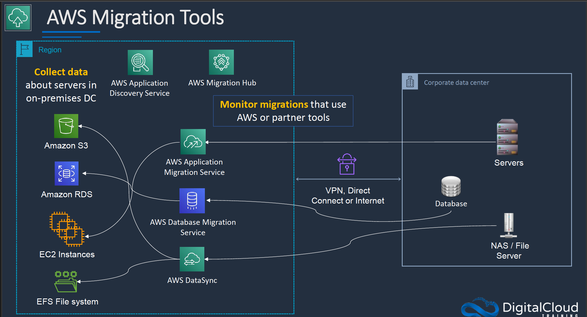
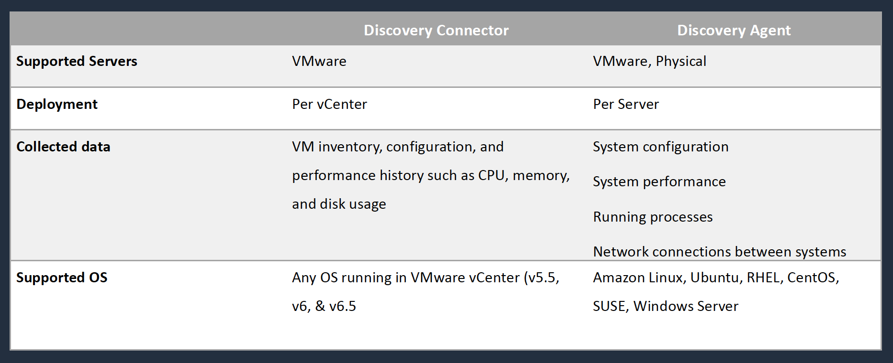

# Section 16: Migration and Transfer Services

## AWS Application Discovery Service
Collects server hostnames, IP addresses, MAC addresses, as well as resource allocation and utilization details of key resources including CPU, network, memory, and disk
  

## AWS Database Migration Service (DMS)
__AWS DMS Use Cases__
* __Cloud to Cloud__ – EC2 to RDS, RDS to RDS, RDS to Aurora
* __On-Premises to Cloud__
* __Homogeneous migrations__ – Oracle to Oracle, MySQL to RDS MySQL, Microsoft SQL to RDS for SQL Server
* __Heterogeneous migrations__ – Oracle to Aurora, Oracle to PostgreSQL, Microsoft SQL to RDS MySQL (must convert schema first with the Schema Conversion Tool (SCT))
* __Development and Test__ – use the cloud for dev/test workloads
* __Database consolidation__ – consolidate multiple source DBs to a single target DB
* __Continuous Data Replication__ – use for DR, dev/test, single source multi-target or multi-source single target

## AWS Server Migration Service (SMS)
__Introduction__  
* Agentless service for migrating on-premise and cloud-based VMs to AWS
* Source platforms can be VMware, Hyper-V or Azure
* AWS Server Migration Service Connector is installed on the source platform
* Server volumes are replicated (encrypted with TLS) and saved as AMIs which can then be launched as EC2 instances
* Can use application groupings and SMS launch servers in a CloudFormation stack
* You can replicate your on-premises servers to AWS for up to 90 days (per server)
* Provides automated, live incremental server replication and AWS Console support

## AWS Application Migration Service (MGN)
__Introduction__
* Highly automated lift-and-shift (rehost) solution for migrating applications to AWS
* Utilizes continuous, Mblock-level replication and enables short cutover windows measured in minutes
* The older _Server Migration Service (SMS)_ utilizes incremental, snapshot-based replication and enables cutover windows measured in hours
* AWS recommend using AWS MGN instead of SMS
* Integrates with the Cloud Migration Factory for orchestrating manual processes
* Can migrate virtual and physical servers

__Types of Service Migration__
* __Agentless__: Agentless snapshot-based replication possible with the _AWS MGN vCenter Client_ installed
* __Agent Based__: AWS recommend _agent-based_ replication when possible as it support continuous data protection (CDP)

## AWS DataSync
__Introduction__  
* Secure, online service that automates and accelerates moving data between on premises and AWS Storage services
* DataSync can copy data between:
  - Network File System (NFS) shares
  - Server Message Block (SMB) shares
  - Hadoop Distributed File Systems (HDFS)
  - Self-managed object storage
  - AWS Snowcone
  - Amazon S3 buckets
  - Amazon Elastic File System (Amazon EFS) file systems
  - Amazon FSx (Windows, Lustre, OpenZFS, and NetApp ONTAP)
* A DataSync software agent connects to on-premise storage system

## AWS Snow Family
__Types of Snowball Device__  
* __AWS Snowball and Snowmobile__ are used for migrating large volumes of data to AWS
* __Snowball Edge Compute Optimized__
  - Provides block and object storage and optional GPU
  - Use for data collection, machine learning and processing, and storage in environments with intermittent connectivity (edge use cases)
* __Snowball Edge Storage Optimized__
  - Provides block storage and Amazon S3-compatible object storage
  - Use for local storage and large-scale data transfer
* __Snowcone__  
  -  Small device used for edge computing, storage and data transfer
  - Can transfer data offline or online with AWS DataSync agent

__Snowball usage__  
* Uses a secure storage device for physical transportation
* Snowball Client is software that is installed on a local computer and is used to identify, compress, encrypt, and transfer data
* Uses 256-bit encryption (managed with the AWS KMS) and tamper-resistant enclosures with TPM
* Snowball (80TB) (50TB ) “petabyte scale”
* Snowball Edge (100TB) “petabyte scale”
* Snowmobile – “exabyte scale” with up to 100PB per Snowmobile

__Snowball Optimization__  
Ways to optimize the performance of Snowball transfers:
1. Use the latest Mac or Linux Snowball client
2. Batch small files together
3. Perform multiple copy operations at one time
4. Copy from multiple workstations
5. Transfer directories, not files

__AWS Snowball Use Cases__  
* __Cloud data migration__ – migrate data to the cloud
* __Content distribution__ – send data to clients or customers
* __Tactical Edge Computing__ – collect data and compute
* __Machine learning__ – run ML directly on the device
* __Manufacturing__ – data collection and analysis in the factory
* __Remote locations with simple data__ – pre-processing, tagging, compression etc.

## The 7 Rs of Migrations
* __Refactor__ – Re-architect to a cloud-native serverless architecture
* __Replatform_ – Ex. database to RDS; server to Elastic Beanstalk
* __Repurchase__ – Use a different solution (e.g. SaaS)
* __Rehost__ – OS/App moved to another host system (lift & shift)
* __Relocate__ – Move without modification (lift & Shift)
* __Retain__ – Leave as is (revisit at a later date)
* __Retire__ – No longer needed, get rid of it

### Cheat Sheets
[AWS Migration Services](https://digitalcloud.training/aws-migration-services/)  
