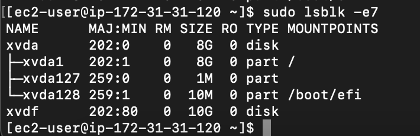

# Create and Attach an EBS Volume - HOL-145

### Description

This template configures a Ebs Volume and attach it to EC2 instances.

### Operation

**Before deployment**

**Deployment**

Lint the templates

```bash
$ cfn-lint EbsVolume.yaml
```

Deploy the `EbsVolume` stack

```bash
$ aws cloudformation deploy --template-file EbsVolume.yaml --stack-name EbsVolume
```

**After deployment**
Get the Public IP addresses for the Instances from the stack outputs

```bash
$ aws cloudformation describe-stacks --stack-name EbsVolume --query "Stacks[0].Outputs" --no-cli-pager
```

**Testing**
SSH into instanceA and list the non-loopback block devices on the instance

```bash
$ sudo lsblk -e7
```

You should see volumes attached to the instance including your EBS volume.

Out attached volume is represented by volume named `xvdf` in the list.

**Cleanup**  
To delete the stacks

```bash
$ aws cloudformation delete-stack --stack-name EbsVolume
```
