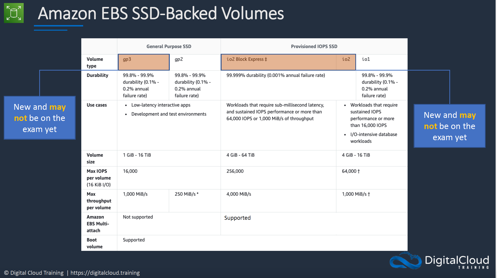
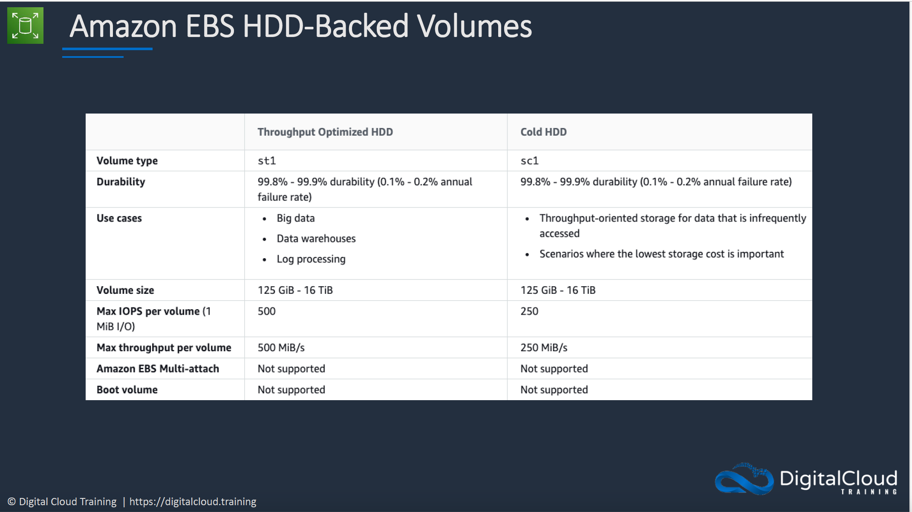
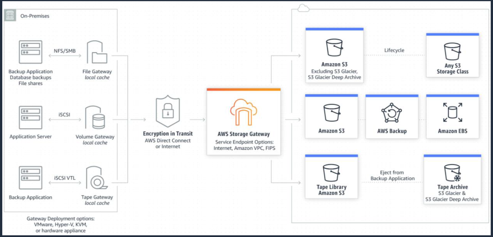

# Section 9: Block and File Storage
## Elastic Block Store (EBS)
__Amazon EBS Volume__   
* EBS Volumes exists within a single availability zones
* The data is replicated to multiple copies for durability but will only remain in the same availability zone
* EBS Volume must be in the same availability zone with the EC2 instances that it is connected to
* Each EBS Volume is normally attached to one EC2 instance at a time exist in the case of _EBS multi-attach_ as explain below  
* EBS volume can be copied from one availability zone to another by creating a snapshot and copying it over.
* Root EBS volumes are deleted by default on termination of the EC2 instance they are attached to
* Extra non-boot volumes are not deleted on termination by default  

__Amazon EBS Multi-Attach__
* Normally an EBS volume can only be attached to one instance at a time
* But with EBS Multi-attach, an EBS volume can be attached to a _maximum 16 EC2 instances_
* Multi-attach is only available for _Nitro system-bases_ EC2 instances
* The volume must be a a _provisioned IOPS i01 volume_
* All the instance connecting to the volume must be in the same availability zone as the volume

__SSD EBS Volume Types__  

__Somethings about provisioned IOPS SSD__  
* Provisioned IOPS SSD (io1, io2) allows you to specify a consistent IOPS rate when you create the volume,
* Amazon EBS delivers within 10 percent of the provisioned IOPS performance 99.9 percent of the time over a given year.
* Therefore you should expect to get 90% of your provisioned IOPS most of the year
* That means if you provisioned 1000 IOPS then you expect to get 900 IOPS most of the year

__HDD EBS Volume Types__  

__EBS Copying, Sharing and Encryption__  
* When you create a snapshot of an EBS volume, it is stored in an S3 bucket.
* Since S3 is a regional service, you can simple restore the snapshot to a new volume in another availability zone.

__Create AMU from Snapshot__  
* You can create a snapshot from an EBS volume
* The snapshot can then be used to create an AMI  
* The AMI can then be used to create a volume in another availability zone.

__Amazon Data Lifecycle Manager (DLM)__   
* DLM automates the creation, retention, and deletion of EBS snapshots and EBS-BACKED AMIs
* DLM helps with the following
  - Protects valuable data by enforcing a regular backup schedule
  - Create standardized AMIs that can be refreshed at regular intervals
  - Retain backups as required by auditors or internal compliance
  - Reduce storage costs by deleting outdated backups
  - Create disaster recovery backup policies that back up data to isolated accounts

__EBS vs instance store__  
* Instance Stores are ephemeral - data is lost when the instance is powered down.    
* Instance store volume root devices are created from AMI templates stored on S3
* Instance store volumes cannot be detached/reattached

__Using RAID with EBS__  
* RAID stands for _Redundant Array of Independent Disks_   
* We take multiple disk and aggregate them together
* This is done to either improve performace or implement redendancy or both
* RAID is configured through your operating system and not on AWS
* Here you make take a couple of EBS volume to create a RAID
* There are different type of RAID
  - RAID 0 and RAID 1 are potential options on EBS
  - RAID 5 and RAID 6 are not recommented by AWS
* RAID 0 is used for striping data across dist for performance improvement
  - Use 2 or more disks
  - If one disk fails, the entire RAID set fails
* RAID 1 is used for mirroring data across disks for redendancy / fault tolerance
 - If one disk fails, the other disk is still working
 - Data gets sents to 2 EBS volumes at the same time

## Amazon Elastic File System (EFS)
__Introduction__  
* __Data consistency__ - write operations for Regional file system are durably stored across Availability Zones
* __File locking__ - NFS client applications can use NFS v4 file locking for read an write operations on EFS files
* __Storage classes__ - there are three options:  
  - __EFS Standard__ - uses SSDs for low latency performance
  - __EFS Infrequent Access (IA)__ - cost effective option
  - __EFS Archive__ - even cheaper for less active data (archival)
* __Durability__ - all storage classes offer 11 9s of durability
* __EFS Replication__ - data is replicated across Regions for disaster recovery purposes with RPO/RTO in the minutes
* __Automatic Backups__ - EFS integrations with AWS Backup Service for automatic file system backups
* __Performance options__ - there are two options:
  - __Provisioned throughput__ - Specify a level of throughput that the file system can drive independent of the file system's size
  - __Bursting throughput__ - Throughput scales with the amount of storage and supports bursting to higher levels

## Amazon FSx
__Introduction__  
* Amazon FSx provides fully managed third-party file systems
* Amazon FSx provides you with two file systems to choose from:
  - __Amazon FSx for Windows File Server__ for Windows-based application
  - __Amazon FSx for Lustre__ for compute-intensive workloads

__Amazon FSx for Windows File Server__  
* Provides a fully managed native Microsoft Windows file system
* Full support for the _SMB protocol_, Windows NTFS and Microsoft Active Directory (AD) integration
* Supports Windows-native file system features:  
  - Access Control Lists (ACLs), shadow copies, and user quotas
  - NTFS file systems that can be accessed from up to thousands of compute instances using the SMB protocol
* __High Availability__: replicates data within Availability Zone (AZ)
* __Multi-AZ__: file systems include an active standby file server in seperate AZs

__Amazon FSx for Lustre__  
* High-performance file system optimized for fast processing of workloads such as:
  - Machine learning
  - High Performance Computing (HPC)
  - Video processing
  - Financial modeling
  - Electronic design automations (EDA)
* Works natively with S3, letting you transparently access your S3 objects as files
* You S3 objects are presented as files in your file system, and you can write your results back to S3
* Provides a POSIX-compliant file system interface

## AWS Storage Gateway
__Introduction__  
There are three types of Storage Gateways
1. File Gateway
2. Volume Gateway
3. Tape Gateway

__AWS Storage Gateway - File Gateway__   
* File gateway provides a virtual _on-premise file server_
* Store and retrieve files as objects in Amazon S3
* Use with on-premise applications, and EC2-based applications that need file storage in S3 for object-based workloads
* File gateway offers _SMB_ or _NTF_-based access to data in Amazon S3 with local caching

__AWS Storage Gateway - Volume Gateway__  
* The volume gateway supports block-based volumes
* Block storage - _iSCSI protocol_
* __Cache Volume Mode__ - the entire dataset is stored on S3 and a cache of the most frequently accessed data is cached on-site
* __Stored Volume Mode__ - the entire dataset is stored on-site and is asynchronously backed up to S3 (EBS point-in-time snapshots). Snapshots are incremental and compressed

__AWS Storage Gateway - Tape Gateway__  
* Used for backup with popular backup software
* Each gateway is preconfigured with a media changer and tape drives, Supported by NetBackup, Backup Exec, Veeam etc
* When creating virtual tapes, you select one of the following sizes: 100gb, 200GB, 400GB, 800GB, 1.5TB, and 2.5TB
* A tape gateway can have up to 1,500 virtual tapes with a maximum aggregate capacity of 1PB
* All data transfered between the gateway ad AWS storage is encrypted using SSL
* All data stored by tape gateway in S3 is encrypted server-side with Amazon S3-Managed Encryption Keys (SSE-S3)

### Cheat Sheets  
[Amazon EBS Cheat Sheets](https://digitalcloud.training/amazon-ebs/)  
[Amazon EFS](https://digitalcloud.training/amazon-efs/)  
