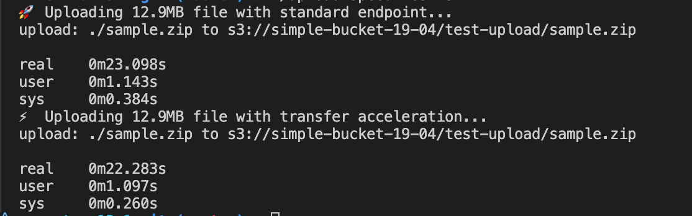
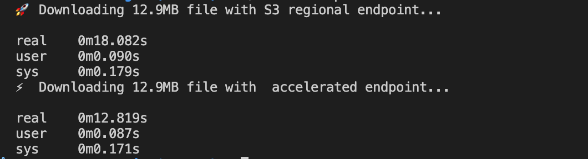

# Extra 13.1: S3 Transfer Acceleration

### Description

This configuration enable S3 Transfer Acceleration on an S3 bucket.

Transfer Acceleration may incur additional costs.  
It works best for large files and global clients.

### Operation

**Deployment**  
Lint all templates

```bash
$ cfn-lint s3TransferAccl.yaml
```

Deploy the stack

```bash
$ aws cloudformation deploy --template-file s3TransferAccl.yaml  --stack-name s3TransferAccl
```

**After Deployment**  
Get the `TransferAccelerationEndpoint` and `RegionalEndpoint` from the Stack Outputs

```bash
$ aws cloudformation describe-stacks --stack-name s3TransferAccl --query "Stacks[0].Outputs" --no-cli-pager
```

Use the values to update the `regionalEndpoint` and `transferAccelerationEndpoint` variables in the `download-speed-test.sh` script.

**Testing**

1. To check if a bucket have Transfer Acceleration configured

```bash
$ aws s3api get-bucket-accelerate-configuration --bucket simple-bucket-19-04
```

2. Use the S3 _Transfer Accelerate Endpoint_ to upload a file to the S3 bucket

```bash
$ aws s3 cp sample.zip s3://simple-bucket-19-04/ --endpoint-url https://s3-accelerate.amazonaws.com
```

3. Run the upload speed test

```bash
$ ./upload-speed-test.sh
```



4. Run the download speed test

```bash
$ ./download-speed-test.sh
```



**Debug Errors**  
In the case of error during deployment, checkout the stack events

```bash
$ aws cloudformation describe-stack-events --stack-name s3TransferAccl
```

**Cleanup**  
Delete all the objects in the bucket

```bash
$ aws s3 rm s3://simple-bucket-19-04/ --recursive
```

To delete the stack

```bash
$ aws cloudformation delete-stack --stack-name s3TransferAccl
```
