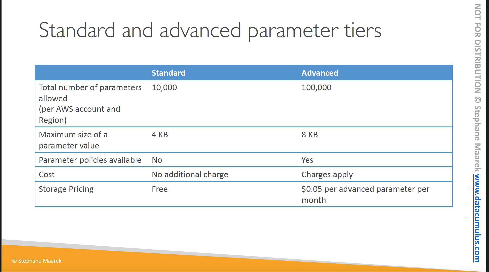

# Section 26: AWS Security and Encryption
__KMS, Encryption SDK, SSM Parameter Store__     

## AWS KMS (Key Management Service)  
__Introduction__  
Formerly known as Customer Master Key
* Never ever store your secrets in plaintext, especially in your code!
  - KMS Key Encryption also available through API calls (SDL, CLI)
  - Encrypted secrets can be stored in the code / environment variables

__Types of KMS Key__   
1. Symmetric (AES-256 keys)
  - Single encryption key that is used to Encrypt and Decrypt
  - AWS service that are integrated with KMS use Symmetric KMS keys
  - You never get access to the KMS Key unencrypted (must call KMS API to use)
2. Asymmetric (RSA & ECC Key pairs)
  - Public (Encrypt) and Private Key (Decrypt) pair
  - Used for Encrypt/Decrypt or Sign/Verify operations
  - The public key is downloadable, but you can't access the Private Key unencrypted
  - _Use cases_: encryption outside of AWS by users who can't call the KMS API

__AWS KMS Keys__  
* Types of KMS Keys:
  - AWS Owned Keys (free): SSE-S3, SSE-SQS, SSE-DDB (default keys)
  - AWS Managed Key: (free): (aws/service-name, e.g aws/rd, aws/ebs)
  - Customer Managed Keys created in KMS: $1/month
  - Customer managed keys imported: $1/month
  - +pay for API calls to KMS ($0.03 / 10,000 calls)
* Automatic Key rotation:
  - AWS-managed KMS Key: automatic every 1 year
  - Customer-managed KMS Key: (must enable) automatic & on-demand

__Copying Snapshots across regions__  
KMS keys are scoped per region.  
This is how to copy over encrypted EBS volume from one region to another
1. Take a snapshot of the encrypted EBS volume
2. Copy over and re-encrypt the snapshot using a different KMS key in the target region
3. Restore the EBS snapshot to it's own volume using the KMS key in the target region

__KMS Key Policies__  
* Control access to KMS keys, similar to S3 bucket policies
* Difference: nobody can access the KMS keys without them

* __Default KMS Key Policies:__  
  - Created if you don't provide a specific KMS key Policy
  - Complete access to the key to the root user = entire AWS account
* __Custom KMS Key Policy:__    
  - Define users, roles that can access the KMS key
  - Define who can administer the key
  - Useful for cross-account access of your KMS key

__Copying Snapshots across accounts__  
1. Create a snapshot, encrypted with your own KMS Key,  specifically, Customer Managed Key (CMK)
2. Attach a KMS Key Policy to authorize cross-account access
3. Share the encrypted snapshot
4. In target account, create a copy of the Snapshot, encrypt it with a CMK in your account
5. Create a volume from the snapshot

__KMS Multi-Region Key__   
* Identical KMS keys in different AWS regions that can be used interchangeably
* Multi-Region keys have the same key Id, key material, automatic rotation
* Encrypt in one region and decrypt in another region
* No need to re-encrypt or making cross-region API calls
* KMS Multi-Region are NOT global (Primary + Replicas)
* Each multi-region key is managed independently
* Multi-region key is not recommended except for specific use cases.
* __Use cases:__ global client-side  encryption, encryption on Global DynamoDB, Global Aurora

__S3 Replication Encryption Considerations__  
* Unencrypted objects and objects encrypted with SSE-S3 are replicated by default
* Objects encrypted with SS3-C (customer provided key) can be replicated
* For objects encrypted with SS3-KMS, you need to enable the options
  - Specify which KMS key to encrypt the objects within the target bucket
  - Adapt the KMS key policy for the target key
  - An IAM role with kms:Decrypt for the source KMS key and kms:Encrypt for the target KMS key
  -  You might get KMS throttling error, in which case you can ask for  a service quotas increase
* You can use multi-region AWS KMS keys but they are currently treated as independent keys by Amazon S3 (the object will still be decrypted and then encrypted)

__AMI Sharing Process Encrypted via KMS__    
1. AMI in source Account is encrypted with KMS key from source account
2. Must modify the image attribute to add a _Launch Permission_ which corresponds to the specified target AWS account
3. Must share the KMS Keys used to encrypt the snapshot of the AMI reference with the target account / IAM role
4. The IAM Role/User in the target account must have the permission to _DescribeKey_, _ReEncrypt_, _CreateGrant_, _Decrypt_.  
5. When launching an EC2 instance from the AMI, optionally the target account can specify a new KMS key in its own account to re-encrypt the volumes.

## SSM Parameter Store
__Introduction__  
* Secure storage for configuration and secrets
* Optional seamless encryption using KMS  
* Serverless, scalable, durable, easy SDK
* Version tracking of configuration / secrets
* Security through IAM
* Notification with Amazon EventBridge
* Integration with CloudFormation

__SSM Parameter Store Hierarchy__  
You can organize you parameter in a structured hierarchy fashion.  
There are public parameters issued by AWS that you can use, such as the parameter for the latest Amazon Linux 2 AMI:
* `/aws/service/ami-amazon-linux-latest/amzn2-ami-hvm-x86_64-gp2`  

__Standard and advanced parameter tiers__  

__Parameters Policies (for advanced parameters)__   
* Allow to  assign a TTL to a parameter (expiration date) to force updating or deleting sensitive data such as a password
* Can assign multiple policies at a time

## AWS Secrets Manager  
__Introduction__  
* Newer service meant for storing secrets
* Capability to force rotation of secrets every X days
* Automate generation of secrets on rotation (uses Lambda)
* Integration with Amazon RDS (MySQL, PostgreSQL, Aurora)
* Secrets are encrypted using KMS
* Most meant for RDS integration

__AWS Secrets Manager - Multi-Region Secrets__  
* Replicate secrets across multiple AWS Regions
* Secrets Manager keeps read replicas in sync with the primary Secret
* Ability to promote a read replica Secret to a standalone Secret
* Use cases: multi-region apps, disaster recovery strategies, multi-region DB...

## AWS Certificate Manager (ACM)
__Introduction__  
* Easily provision, manage and deploy TLS Certificates
* Provision in-flight encryption for Websites (HTTPS)
* Supports both public and private TLS certificates
* Free of charge for public TLS certificates
* Automatic TLS certificate renewal
* Integrations with (load TLS Certificates on)
  - Elastic Load Balancer (CLB, ALB, NLB)
  - CloudFront Distributions
  - APIs on API Gateway
* Cannot use ACM with EC2 (can't be extracted)

__ACM - Importing Public Certificates__  
* Options to generate the certificate outside of ACM and then import it
* No automatic renewal, must import a new certificate before expiry
* ACM sends daily expiration events starting 45 dats prior to expiration
  - The number of days can be configured
  - Events will be triggered on EventBridge for expiration notification
* AWS Config has a managed rule name `acm-certificate-expiration-check`  to check for expiring certificates (configurable number of days)

__API Gateway - Endpoint Types__
* __Edge-Optimized (default)__: For global clients
  - Requests are routed through the CloudFront Edge locations (improves latency)
  - The API Gateway still lives in only one region
* __Regional__:
  - For clients within the same region
  - Could manually combine with CloudFront (more control over the caching strategy and the distribution)
* __Private__:
  - Can only be accessed from your VPC using an interface VPC endpoint (ENI)
  - Use a resource policy to define access

## AWS Web Application Firewall ( WAF)
__Introduction__  
* Protects your web applications from web exploits (Layer 7)
* _Layer 7_ is HTTP while _Layer 4_ is TCP/UDP
* Deploy on
  - Application Load Balancer
  - API Gateway
  - CloudFront
  - AppSync GraphQL API
  - Cognito User pool
  - AWS App Runner service
  - AWS Amplify application,  
  - AWS Verified Access instance.
* WAF does not support Network Load Balancer!

__WAF ACL Rules__  
* Define Web Access Control List (ACL) Rules
  - IP Set: up to 10,000 IP addresses - use multiple Rules for more IPs
  - HTTP headers, HTTP body, or URI strings Protects from common attack - SQL injection and Cross-Site Scripting (XSS)
  - Size constraint, geo-match (block countries)
  - Rate-based rules (to count occurrences of events) - for DDoS protection
* Web ACL are regional except for CloudFront where they are global
* A rule group is a reusable set of rules that you can add to a web ACL

__WAF - Fixed IP while using WAF with an Application Load Balancer__  
* WAF required a static IP to integrate with a service but ALB does not have a static IP
* To solve this problem we use a _Global Accelerator_ to get a fixed IP and then integrate WAF to the ALB.  

## AWS Shield: protect from DDoS attack
* DDoS: Distributed Denial of Service - many requests at the same time
* __AWS Shield Standard__:
  - Free service that is activated for every AWS customer
  - Provides protection from attacks such as SYN/UDP Floods, Reflection attack and other later 3/layer 4 attacks
* __AWS Shield Advanced__:  
  - Optimized DDoS mitigation service ($3,000 per month per organization)
  - Protect against more sophisticated attack on _EC2_, _ELB_, _CloudFront_, _Global Accelerator_ and _Route53_.
  - 24/7 access to AWS DDoS response team (DRP)
  - Protect against higher fees during usage spikes due to DDoS
  - Shield Advanced automatic application layer DDoS mitigation automatically creates, evaluates and deploys AWS WAF rules to mitigate layer 7 attacks.

## AWS Firewall Manager
__Introduction__  
* Manages rules in all accounts of an AWS Organization
* Security policy: common set of security rules
  - WAF rules (ALB, API Gateway, CloudFront)
  - AWS Shield Advanced (ALB, CLB, NLB, Elastic IP, CloudFront)
  - Security Groups for ECS, ALB and ENI resources in VPC
  - AWS Network Firewall (VPC Level)
  - Amazon Route 53 Resolver DNS Firewall
  - Policies are created at the region level
* Rules are applied to new resources as they are created (good for compliance) across all and future accounts in your Organization

__WAF vs Firewall Manager vs Shield__  
* WAF, Shield and Firewall Manager are used together for comprehensive protection
* Define your Web ACL rules in WAF if you want to protect one resource at a time
* For granular protection of your resources, WAF alone is the correct choice  
* If you want to use AWS WAF across accounts and to accelerate WAF configuration, and automate the protection of new resources, use the Firewall Manager with AWS WAF
* Shield Advanced adds additional features on top of AWS WAF, such as dedicated support from the Shield Response Team (SRT) and advanced reporting
* If you are prone to frequent DDoS attacks, consider purchasing Shield Advanced

## Amazon GuardDuty
__Introduction__  
* Intelligent Threat discovery to protect your AWS Account
* Uses Machine Learning algorithms, anomaly detection, 3rd party data
* One click to enable (30 days trial), no need to install software
* Input data includes:
  - CloudTrail Events Logs - unusual API calls, unauthorized deployments
    * CloudTrail Management Events - create VPC subnet, create trail
    * CloudTrail S3 Data Events - get objects, list objects, delete object
  - VPC Flow Logs - unusual internal traffic, unusual IP address
  - DNS Logs - compromised EC2 instance sending encoded data within DNS queries
  - Optional Features - EKS Audit Logs, RDS & Aurora, EBS, Lambda, S3 Data Events
* Can setup EventBridge rules to be notified in case of findings
* EventBridge rules can target AWS Lambda or SNS
* Can protect against CryptoCurrency attack (has a dedicated "finding" for it)

## Amazon Inspector
__Introduction__  
* Automated Security Assessments
* For EC2 instances
  - Leverages the AWS System Managers (SSM) agent
  - Analyze against unintended network accessibility
  - Analyze the running OS against known vulnerabilities
* For Container Images push to ECR
  -  Assessment of Container Images as they are pushed
* For Lambda Functions
  - Identifies software vulnerabilities in function code and package dependencies
  - Assessment of functions as they are deployed
* Reporting & integration with _AWS Security Hub_
* Send findings to Amazon Event Bridge

__What does Amazon Inspector evaluate?__  
* Remember: only for EC2 instances, Container Images & Lambda functions
* Continuous scanning of the infrastructure, only when needed
* Package vulnerabilities (EC2, ECR, & Lambda) - database of CVEprioritization
* Network reachability (EC2)
* A risk score is associated with all vulnerabilities for prioritization

## Amazon Macie
__Introduction__  
* _Amazon Macie_ is a fully managed data security and data privacy service that uses machine learning and pattern matching to discover and protect your sensitive data in AWS
* _Macie_ helps identify and alert you to sensitive data, such as Personally Identifiable Information (PII)
* _Macie_ will send an event to Amazon EventBridge for any notification
