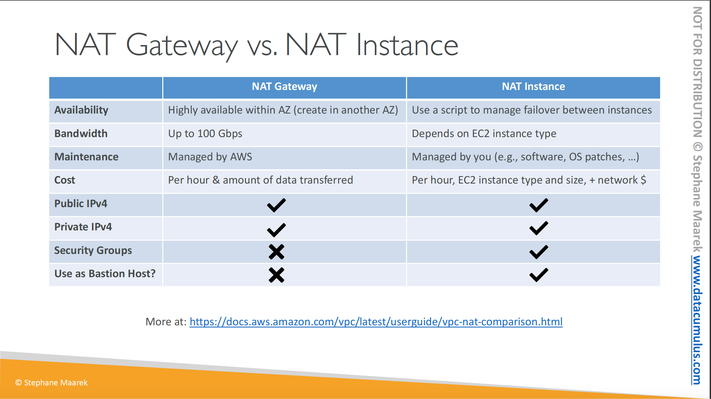
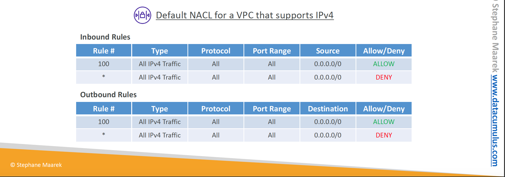
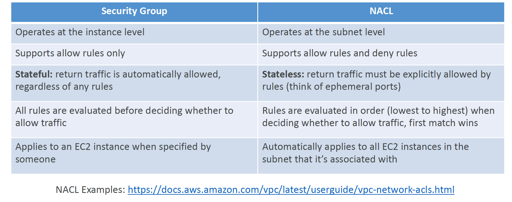
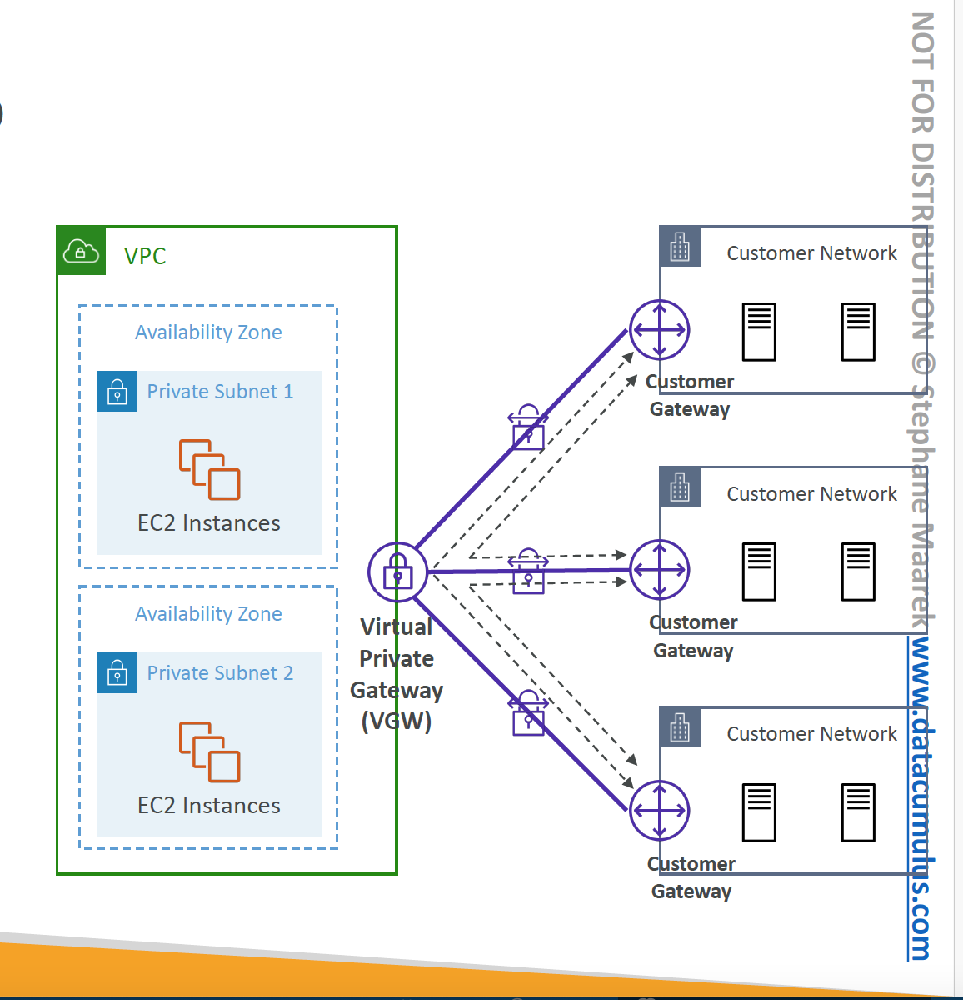

# Section 27: Networking - VPC
__Public vs Private IP (IPv4)__  
* The Internet Assigned Numbers Authority (IANA) established certain blocks of IPv4 address foR the use of private (LAN) and Public (Internet) addresses
* Private IP can only allow certain values:  
  - 10.0.0.0 - 10.255.255.255 (10.0.0.0/8) <- in big networks
  - 172.16.0.0 - 172.31.255.255 <- AWS default VPC in that range
  - 192.168.0.0 - 192.168.255.255 <- e.g home networks
* All the rest of the IP addresses on the Internet are Public

__VPC in AWS IPv4__  
* You can have multiple VPCs in an AWS region (max. 5 per region – soft limit)
* Max. CIDR per VPC is 5, for each CIDR:
  - Min. size is /28 (16 IP addresses)
  - Max. size is /16 (65536 IP addresses)
* Because VPC is private, only the Private IPv4 ranges are allowed:
  - 10.0.0.0 – 10.255.255.255 (10.0.0.0/8)
  - 172.16.0.0 – 172.31.255.255 (172.16.0.0/12)
  - 192.168.0.0 – 192.168.255.255 (192.168.0.0/16)
* Your VPC CIDR should NOT overlap with your other networks (e.g.,
corporate)

__VPC -Subnet (IPv4)__  
* AWS reserves 5 IP addresses (first 4 & last 1) in each subnet
* These 5 IP addresses are not available for use and can't be assigned to an EC2 instance
* Example: if CIDR block is 10.0.0.0/24 then reserves IP addresses are
  - 10.0.0.0 - Network Address
  - 10.0.0.1 - reserved by AWS for the VPC router
  - 10.0.0.2 - reserved by AWS for mapping to Amazon-provided DNS
  - 10.0.0.3 - reserved by AWS for future use
  - 10.0.0.255 - Network Broadcast Address, AWS does not support broadcast in a VPC, therefor the address is reserved
* __Exam Tip__, if you need 29 IP addresses for EC2 INSTANCES:
  - You can't choose a subnet of size /27 (32 IP address, 32 - 5 = 27 < 29)
  - You need to choose a subnet of size /26 (64 IP address, 64 - 5 = 59 > 29)

## NAT Instance (outdated, but still in the exam)
__Introduction__  
* NAT = Network Address Translation
* Allows EC2 instance in private subnets to connect to the internet
* Must be launched in a public subnet
* Must disable EC2 setting: _Source/destination check_
* Must have Elastic IP attached to it
* Route Table must be configured to route traffic from private subnets to the NAT Instance

__NAT Instance - Comments__  
* Pre-configured Amazon Linux AMI is available
  - Reached the end of standard support on December 31, 2020
* Not highly available / resilient setup out of the box
  - You need to create an ASG in multi-AZ + resilient user-data script
* Internet traffic bandwidth depends on EC2 instance type
* You must manage Security Groups and rules:
  - Inbound:
    * Allow HTTP/HTTPS traffic coming from Private Subnets
    * Allow SSH from you home network (access is provided through Internet Gateway)
  - Outbound
    * Allow HTTP/HTTPS traffic to the Internet

## NAT Gateway
__Introduction__  
* AWS-managedd NAT, higher bandwidth, high availability, no administration
* Pay per hour of usage and bandwidth
* NAT Gateway is created in a specific Availability Zone, uses an Elastic IP
* Can't be used by EC2 instance in the same subnet (only from other subnets)
* Requires an IGW (Private Subnet => NATGW => IGW)
* 5 Gbps of bandwidth with automatic scaling up to 100Gb
* No Security Groups to manage / required

__NAT Gateway with High Availability__  
* NAT Gateway is resilient within a single Availability Zone
* We must create multiple NAT Gateways in multiple AZs for fault-tolerance
* There is no cross-AZ failover needed because if an AZ goes down it doesn't need NAT

__NAT Gateway vs. NAT Instance__  

## Security Groups and Network Access List (NACL)
__Network Access Control List (NACL)__  
* NACL are like firewall which control traffic from and to subnets
* One NACL per subnet, new subnets are assigned the _Default NACL_
* You defined NACL Rules:
  - Rules have a number (1-32,766), higher precedence with a lower number
  - First rule match will drive the decision
  - The last rule is an asterick (*) and denies a request in case of no rule match
  - AWS recommends adding rules by increment of 100
* Newly created NACLs will deny everything
* NACL are great way of blocking a specific IP address at the subnet level

__Default NACL__  
* Accepts everything inbound/outbound with the subnets it's associated with
* Do NOT modify the default NACL, instead create custom NACLs

__Ephemeral Ports__  
* For any two endpoints to establish a connection, they must use ports
* Clients connect to a defined port, and expect a response on an ephemeral port
* Different Operating Systems use different port ranges, examples:
  - IANA & MS Windows 10 è 49152 – 65535
  - Many Linux Kernels è 32768 – 60999

__Security Group vs. NACLs__  

## VPC Peering
__Introduction__  
* Privately connect two VPCs using AWS' network
* Make them behave as if they were in the same network
* Must not have overlapping CIDRs
* VPC Peering connection is _NOT transitive_ (must be established for each VPC that need to communicate with one another)
* You must update route tables in each VPC's subnets to ensure EC2 instances can communicate with each other

__VPC Peering - Good to know__  
* You can create VPC Peering connection between VPCs in different AWS accounts/regions
* You can reference a security group in a peered VPC (works cross accounts - same region)

## VPC endpoints
__VPC Endpoint (AWS PrivateLink)__  
* Every AWS service is publicly exposed (publiC URL)
* VPC Endpoints (powered by AWS PrivateLink) allows you to connect to AWS services using a _private network_ instead of using the public internet
* They are redundant and scale horizontally
* They remove the need of IGT, NatGW to access AWS Services
* In case of issues
  - Check DNS Setting Resolution in your VPC
  - Check Route Tables

__Type of Endpoints__  
* __Interface Endpoints (powered by PrivateLink)__
  - Provisions an ENI (private IP address) as an entry point (must attach a security Group)
  - Supports most AWS services
  - $ per hour + $ per GB of data processed
* __Gateway Endpoints__  
  - Provisions a gateway and must be used as a target in a route table (dies not use security groups)
  - Supports both S3 and DynamoDB
  - Free

__Gateway or Interface Endpoint for S3__  
* Gateway is most likely going to be preferred all the time at the exam
* Cost: free for Gateway, $ for interface endpoint
* Interface Endpoint is preferred access is required from on-premise (Site ti Site VPN or Direct Connect), a different VPC or a different region.  

## VPC Flow Logs
__Introduction__  
* Capture information about IP traffic going into your interfaces:
  - VPC Flow Logs
  - Subnet Flow Logs
  - Elastic Network Interface (ENI) Flow Logs
* Helps to monitor and troubleshoot connectivity issues
* Flow logs data can go to S3, CloudWatch Logs, and Kinesis Data Firehose
* Captures network information from AWS managed interfaces too: ELB, RDS, ElasticCache, Redshift, Workspaces, NatGW, Transit Gateway...

## AWS Site-to-Site VPN (S2S VPN)
__Introduction__  
We want to connect AWS to our Cooperate Data Center, or on-premises,  using a private connection.  
For this, we need a _Customer Gateway_ on the Cooperate Data Center and a _VPC Gateway_ on our AWS VPC.   
We then establish a _private site-to-site VPN_ through the public internet. The connection is encrypted.  
To establish S2S VPN we need the following
1. __Virtual Private Gateway (VGW)__
  - VPN concentrator on the AWS side of the VPN connection
  - VGW is created and attached to the VPC from which you want to create the Site-to-Site VPN connection
  - Possibility to customize the ASN (Autonomous System Number)
2. __Customer Gateway (CGW)__  
  - This is a software application or physical device on customer side of the VPN connection
  - Check out [AWS Site-to-Site VPN customer gateway devices](https://docs.aws.amazon.com/vpn/latest/s2svpn/your-cgw.html#DevicesTested)

__Site-to-Site VPN Connections__  
* Customer Gateway Device (on-premises)
  - What IP address to use?
    * Public Internet-routable IP address for you Customer Gateway device
    * If it's behind a NAT device that's enabled for NAT traversal (NAT-T), use the public IP address of the NAT device
* __Important step:__ enable _Route Propagation_ for the Virtual Private Gateway in the route table that is associated with your subnets.   
* If you need to ping your EC2 instance from on-premises, make sure you add the ICMP protocol on the inbound of your security groups

__AWS VPN CloudHub__  
* Provide secure communication between multiple sites (data centers), if you have multiple VPN connections
* Low-cost _hub-and-spoke model_ for primary or secondary network connectivity between different locations (VPN only)
* It's a VPN connection so it goes over the public internet
* To set it up, connect multiple VPN connections on the same VGW, setup dynamic routing and configure route tables.  

## Direct Connect (DX)
__Introduction__  
* It provides a dedicated _private_ connection from a remote network to your VPC
* A dedicated connection must be setup between your Cooperate Data Center and _AWS Direct Connect location_
* You need to setup a _Virtual Private Gateway_ on your VPC
* On the same connection you can access public resources such are S3 and private EC2 instances using the public virtual interface and the private virtual interface
* Use Cases:
  - Increase bandwidth throughput because it works via a private connection. Good for working with large  data sets and give lower cost
  - More consistent network experience - applications using real-time data feeds
  - Support for Hybrid Environment (on prem + cloud)
* Supports both IPv4 and IPv6

__Direct Connect Gateway__   
* If you want to setup a Direct Connect to one or more VPC in many different regions (same account), you must use a _Direct Connect Gateway_.  

__Direct Connect - Connection Types__   
* __Dedicated Connections__: 1Gbps, 10Gbps and 100 Gbps capacity
  - Physical ethernet port dedicated to a customer
  - Request made to AWS first, then completed by AWS Direct Connect Partners
* __Hosted Connections__: 50Mbps, 500Mbps to 10Gbps
  - Connection request are made via AWS Direct Connection Partners
  - Capacity can be added or removed on demand
  - 1, 2, 5, 10 Gbps available at select AWS Direct Connection Partners
* Lead times are often longer then 1 month to establish a new connection

__Direct Connect - Encryption__  
* Data in transit is _not encrypted_ but is private
* AWS Direct Connect + VPN provides an IPsec-encrypted private connection
* Good for an extra level of security but slightly more complex to put in place.  

__Direct Connection - Resiliency__  
__High Resiliency for Critical Workloads__: Use multiple direct connection location with one connection per location
__Maximum Resiliency for Critical Workload__: Use multiple direct connection location with multiple connection per location.  

__Site-to-Site VPN connection as a backup__  
You can setup a _Site-to-Site VPN_ connection to serve as a Backup connection to your _Direct Connect_ which is your primary connection.  

## Transit Gateway
__Introduction__
* For transitive peering between thousands of VPC and on-premises with hub-and-spoke (star) connection
* It is a regional resource and can also work cross-region
* You can share your Transit Gateway cross-account by using the Resource Access Manager (RAM)
* You can peer Transit Gateway across region
* Route tables are used to limit which VPCs can connect to each other
* It works with _Direct Connect Gateway_ or _VPN connections_  
* It is the only service in AWS that supports _IP Multicast_

__Transit Gateway: Site-to-Site VPN ECMP__  
* ECMP = Equal-cost multi-path routing
* Routing strategy to allow to forward a packet over multiple best path
* Use case: create multiple Site-to-Site VPN connections to _increase the bandwidth of you connection to AWS_
@todo: Come back to this - Lesson 344

__Transit Gateway: throughput with ECMP__  
@todo: Come back to this - Lesson 344

__Transit Gateway - Share Direct Connect between multiple accounts__  
@todo Come back to this - Lesson 344

## VPC -  Traffic Mirroring
__Introduction__  
* Allows you to capture and inspect network traffic in your VPC in a non-intrusive manner
* You do this by routing traffic to a security appliance you manager
* To capture the traffic you need to specify the following
  - Source ENIs
  - Target ENIs or Network Load Balancer
* Capture all packets or capture the packets of interest (optionally, truncate packets)
* Source and Target can be in the same VPC or different VPCs with VPC peering
* Use cases:  content inspection, threat monitoring, troubleshooting...

## IPv6 for VPC
__IPv6 in VPC__   
* IPv4 cannot be disabled for your VPC and subnets
* You can enable IPv6 to operate in dual-stack mode. IPv6 are public IP addresses
* Your EC2 instances will get at least a private internal IPv4 and a public IPv6
* They can communicate using either IPv4 or IPv6 to the internet through an Internet Gateway

__IPv4 Troubleshooting__  
* IPv4 cannot be disabled for your VPC and subnets
* So if you cannot launch an EC2 instance in your subnet
  - It is not because it cannot acquire an IPv6 (the space is ver large)
  - It is because there are no available IPv4 in your subnet
* __Solution__: create a new IPv4 CIDR in your subnet

## Egress-only Internet Gateway
__Introduction__  
* Used for IPv6 only
* Similar to NAT Gateway but for IPv6
* Allows instances in your VPC outbound connections over IPv6 while preventing the internet fro initiating an IPv6 connection to your instances
* You must update the Route Tables

## Networking Costs in AWS per GB - Simplified
__Regional and Cross-Region data transfer cost__  
* Data transfer cost
  - From public internet to instance in AZ - free
  - Between instances in the same AZ - free
  - Between instance in different AZ (using private IP) - $0.01 per GB
  - Between instance in different AZ (using public IP) - $0.02 per GB
  - Between instance in different region  - $0.02 per GB
* Use private IP instead of public IP for good savings and better network performance

__Minimizing egress traffic network cost__  
* Ingress traffic is typically free
* Egress traffic has a cost
* Try to keep as much internet traffic within AWS to minimize cost
* If using _Direct Connect_, choice _Direct Connect_ location that are co-located in the same AWS Region for lower cost for egress network.

__S3 Data Transfer Pricing - Analysis for USA__  
* S3 ingress is free
* S3 to Internet: $0.09 per GB
* S3 Transfer Acceleration:
  - Faster transfer times (50 to 500% better)
  - Additional cost on top of Data Transfer Pricing: +$0.04 to $0.08 per GB
* S3 CloudFront: $0.00 per GB
* CloudFront to Internet: $0.085 per GB (slightly cheeper than S3)
  - Caching capability (lower latency)
  - Reduce cost associated with S3 requests pricing (7x cheaper with CloudFront)
* S3 Cross Regional Replication: $0.02 per GB

__Pricing:  NAT Gateway vs Gateway VPC Endpoint__
* NAT Gateway
  - $0.045 NAT Gateway / hour
  - $0.045 NAT Gateway data processed / GB
  - $0.09 Data transfer out to S3 (cross-region)
  - $0.00 Data transfer out to S3 (same-region)
* VPC Endpoint:
  - No cost for using Gateway Endpoint.
  - $0.01 Data transfer in/out (same region)

## AWS Firewall
__AWS Network Firewall__  
* Protect your entire VPC
* From Layer 3 to Layer 7 protection
* Any direction you can inspect
  - VPC to VPC traffic
  - Outbound to internet
  - Inbound from internet
  - To/from Direct Connect and Site-to-Site VPN
* Internally the AWS Network Firewall uses the AWS Gateway Load Balancer
* Rules can be centrally managed cross-account by _AWS Firewall Manager_ to apply to many VPCs

__Network Firewall - Fine Grained Controls__  
* Supports 1000s of rules
  - IP & port
  - protocol
  - Stateful domain list rules groups only allows outbound traffic to *.mycorp.com or third party
  - General pattern matching using regex
* Traffic filtering: Allow, drop, alert for the traffic that matches the rules
* Active flow inspection to protect against network threats with intrusion-prevention capability (like Gateway Load Balancer, but all managed by AWS)
* Send logs of rule matches to Amazon S3, CloudWatch Logs, Kinesis Data Firehose

### Resources
For CIDR Block Calculations use [ipaddressguide.com](https://www.ipaddressguide.com/cidr)  
To  check if you have IPv6 on your home network use [test-ipv6.com](https://test-ipv6.com/)
