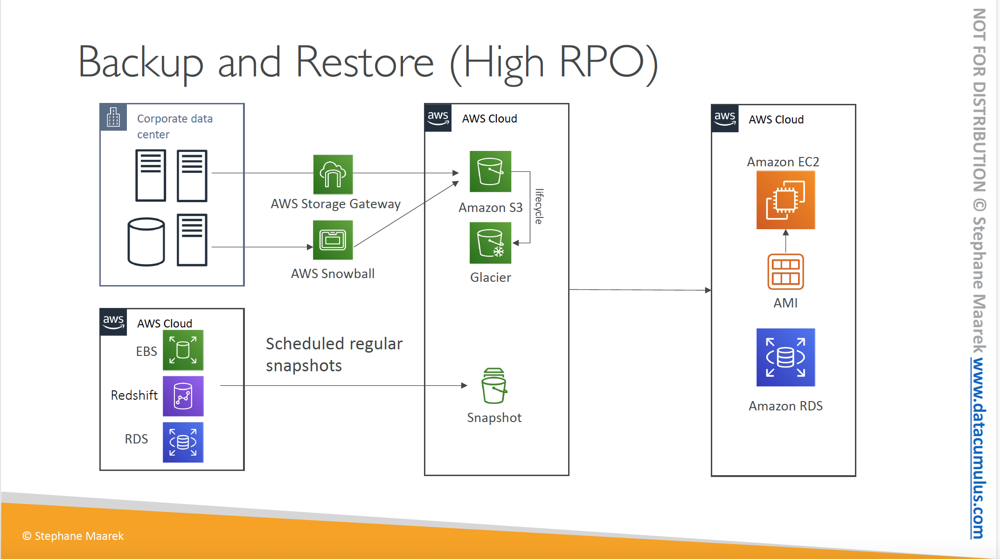
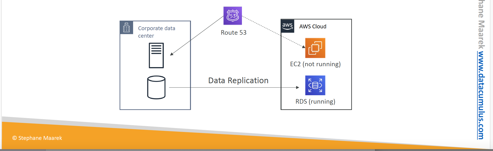
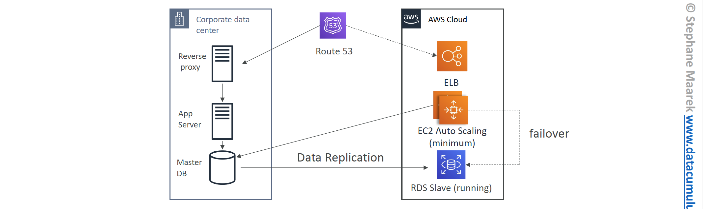
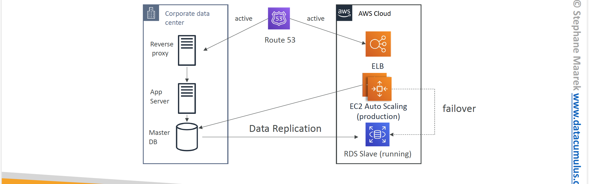
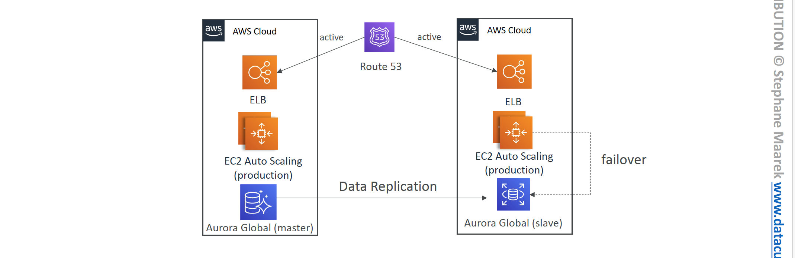

# Section 28: Disaster Recovery and Migrations
__Disaster Recovery Overview__  
* What kind of disaster recovery do we have?
  - On-premise => on-premise: traditional DR and very expensive
  - On-premise => AWS Cloud: hybrid recovery
  - AWS Cloud Region A => AWS Cloud Region B

__Disaster Recovery Terms__  
* RPO: Recovery Point Objective
* RTO: Recovery Time Object

__RPO and RTO__  
The _Recovery Point Object (RPO)_ represents how often you run backups, it determine how back in time you can recover.
When disaster strike, the time between the disaster and the RPO will become a data loss. The RPO represents how much of a data loss you are willing to accept in case of a disaster.

The _Recovery Time Object (RTO)_ represents the time it take for you to recovery from a disaster. It is the amount of downtime the application endures after a disaster.  

Usually, the smaller the RPO and or RTO, the higher the cost of the recovery strategy.

__Disaster Recovery Strategies__  
1. Backup and Restore
2. Pilot Light
3. Warm Standby
4. Hot Site / Multi Site Approach
_Backup and Restore_ has the slowest RTO but is cheapest and _Multi Site Approach_ has the fastest RTO but is the most expensive.

__Disaster Recovery - Backup and Restore__  
Here we run backup of our data at a regular interval, for example, we could backup our on-premise data to S3 bucket every day. We can also take regular snapshots of our EBS volumes or RDS instance.  
If disaster strike, we can then restore our instances or application from the backup.   
The _Backup and Restore_ disaster recovery strategy has the highest RPO but is the cheapest to implement.  

__Disaster Recovery - Pilot Light__  
* A small version of the app is always running in the cloud
* Useful for the critical core (pilot light)  
* Very similar to _Backup and Restore_
* Faster than _Backup and Restore_ as critical systems are already running.

For example we could replicate our on-premise database to a running RDS instance.  
If there is a disaster on our on-premise data center, we could launch an EC2 instance and use the RDS replica to support our application now running on the EC2 instance. We can then route all traffic away from our data center into the EC2 instance.

__Disaster Recovery - Warm Stand__  
* Full system is up and running, but at minimum size
* Upon disaster, we can scale to production load.  

For example, we could have our on-premise database replicated to and RDS instance. At the same time we have EC2 instance running in an Auto Scaling Group with an Elastic Load Balancer. The EC2 instance can get its data from our on-premise database instance.    
In the case of a disaster in our on-premise data center, we will have Route53 routing fail over to our AWS Elastic Load Balancer and our EC2 instance now getting data from the replicated RDS instance. We can then scale the infrastructure to production mode.   
This approach reduces our RPO and RTO further than the _Pilot Light_ approach.  

__Disaster Recovery - Multi Site / Hot Site Approach__  
* Very low RTO (minutes or seconds) - very expensive
* Your full production scale application is running on-premise and also on AWS cloud.

For example you can have Route 53 actively routing traffic to you on-premise data center and also to AWS at the same time. This approach is the most expensive and offers the smallest _RPO_ and _RTO_.  

__All AWS Multi Region__   
In this approach we have a fully production scale application running on two AWS regions and we use Route 53 to activley route traffic to the two region. A Global Aurora instance is replicated from one region to the other.  
In the case of a disaster, we can simple have the database connection fail over from the master instance to the slave replica Aurora instance.  

__Disaster Recovery Tips__  
* __Backup__  
  - EBS Snapshot, RDS aitomated backup / Snapshot etc
  - Regular pushes to S3 /S3 IA/ Glacier, Lifecycle Policy, Cross Region Replication
  - From On-Premise: Snow ball or Storage Gateway
* __High Availability__  
  - Use Route53 to Migrate DNS over from Region to Region
  - RDS Multi-AZ, ElastiCache Multi-AZ, EFS, S3
  - Site to Site VPN as a recovery from Direct Connect
* __Replication__
  - RDS Replication (Cross Region), AWS Aurora + Global Database
  - Database replication from on-premise to RDS
  - Storage Gateway
* __Automation__
  - CloudFormation / Elastic Beanstalk to re-create a whole new environment
  - Recover / Reboot EC2 instances with CloudWatch if alarm fails
  - AWS Lambda functions for continuous automations
* __Chaos__  
  - NetFlex has a _"simian-army"_ randomly terminating EC2

## Database Migration Service - DMS
__Introduction__  
* Quick and securely migrate database to AWS, resilient, self healing
* The source database remains available during the migration
* Supports:
  - Homogeneous migrations: e.g Oracle to Oracle
  - Heterogeneous migrations e.g Microsoft SQL Server to Aurora
* Continuous Data Replication using Change Data Capture (CDC)
* You must create an EC2 instance to perform the replication tasks

__DMS Source and Targets__  
__Sources:__  
* On-premise and EC2 instances databases: Oracle, MS SQL Server, MySQL, MariaDB, PostgreSQL, MongoDB, SAP, DB2
* Azure: Azure SQL Database
* Amazon RDS: all including Aurora
* Amazon S3
* DocumentDB
__Targets:__  
* On-premises and EC2 instances database: Oracle, MS SQL SERVER, MySQL, MariaDB, PostgreSQL, SAP
* Amazon RDS
* Redshift, DynamoDB, S3
* OpenSearch Service
* Kinesis Data Stream
* Apache Kafka
* DocumentDB & Amazon Neptune
* Redis & Babelfish

__AWS Schema Conversion Tool (SCT)__    
* Convert your Database's Schema from one engine to another
* e.g Online Transaction Processing OLTP: (SQL Server or Oracle) to MySQL, PostgreSQL, Autora
* e.g Online Analytical Processing OLAP: (Terradata or Oracle) to Amazon Redshift
* You do not need to use SCT if you are migrating the same DB engine

## RDS & Aurora MySQL Migrations
* RDS MySQL to Aurora MySQL
  - Option 1: DB Snapshots from RDS MySQL restored as MySQL Aurora DB
  - Option 2: Create an Aurora Read Replica from your RDS MySQL and when the replica lag is 0, promote it as it's own DB cluster (can take time and cost $)
* External MySQL to Aurora MySQL
  - Option 1:
    * Use _Percona XtraBackup_ to create a file backup in Amazon S3
    * Create Aurora MySQL DB from Amazon S3
  - Option 2:
    * Create an Aurora MySQL DB
    * Use the _mysqldump_ utility to migrate MySQL into Aurora (slower than S3 method)
* Use DMS of both databases are up and running

## RDS & Aurora PostgreSQL Migrations
* RDS PostgreSQL to Aurora PostgreSQL
  - Option 1: DB Snapshots from RDS PostgreSQL restored as PostgreSQL Aurora DB
  - Option 2: Create an Aurora Read Replica from your RDS PostgreSQL and when the replica lag is 0, promote it as it's own DB cluster (can take time and cost $)
* External PostgreSQL to Aurora PostgreSQL
  - Create a backup and put it in Amazon S3
  - Import it using the _aws_s3 Aurora extension_
* Use DMS if both databases are up and running

## On-Premise Strategy with AWS
__Introduction__  
* Ability to download Amazon Linux 2 AMI as VM (.iso format)
* VM Import/Export
  - Migrate existing applications into EC2
  - Create a DR repository strategy for your on-premise VMs
  - Can export back the VMs from EC2 to on-premise
* AWS Application Discovery Service
  - Gather information about your on-premise servers to plan a migration
  - Server utilization and dependency mapping
  - Tracking with AWS Migration Hub
* AWS Database Migration Service (DMS)
  - Replicate On-premise => AWS, AWS => AWS, AWS => On-Premise
  - Works with various database technologies (Oracle, MySQL, DynamoDB, etc)
* AWS Server Migration Service (SMS)
  - Incremental replication of on-premise live server to AWS

## AWS Backup
__Introduction__  
* Fully managed service
* Centrally manage and automate backups across AWS services
* No need to create custom scripts and manual process
* Supported services:
  - Amazon EC2 / Amazon EBS
  - Amazon S3
  - Amazon RDS (all DB engines) / Amazon Aurora / Amazon DynamoDB
  - Amazon EFS / Amazon FSx (Lustre & Windows File Server)
  - AWS Storage Gateway (Volume Gateway)
* Supports cross-region backups
* Supports Point In Time Recovery (PITR) for supported services
* On-demand and Scheduled backups
* Tag-based backup policies
* You create backup policies known as _Backup Plans_
  - Backup frequency (every 12 hours, daily, weekly, monthly, cron expression)
  - Backup window
  - Transition to Cold storage (Never, Days, Weeks, Months, Years)
  - Retention Period (Always, Days, Weeks, Months, Years)

  __AWS Backup Vault Lock__  
  * Enforce a WORM (Write Once Read Many) state for all the backups that you store in your AWS Backup Vault.
  * Additional layer of defense to protect your backups against
    - inadvertent or malicious delete operations
    - Updates that shorted or alter retention periods
  * Event the root user cannot delete backups when enabled
