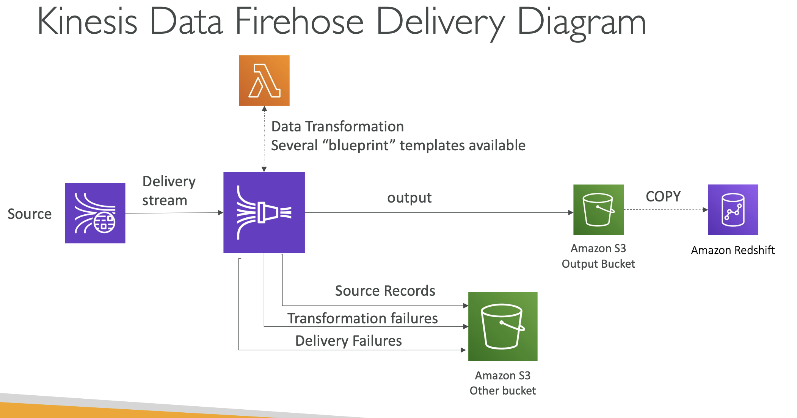

# Section 10: Data Engineering

## Amazon Kinesis Data Streams
__Introduction__  
* Retention between up to 365 days
* Ability to reprocess (replay) data by consumers
* Data can’t be deleted from Kinesis (until it expires)
* Data up to 10MiB (typical use case is lot of “small” real-time data)
* Data ordering guarantee for data with the same “Partition ID”
* At-rest KMS encryption, in-flight HTTPS encryption
* Use _Kinesis Producer Library (KPL)_ to write an optimized producer application
* Use _Kinesis Client Library (KCL)_ to write an optimized consumer application

__Kinesis Data Streams – Capacity Modes__  
* __Provisioned mode:__
  - Choose number of shards
  - Each shard gets 1MB/s in (or 1000 records per second)
  - Each shard gets 2MB/s out
  - Scale manually to increase or decrease the number of shards
  - You pay per shard provisioned per hour
* __On-demand mode:__
  - No need to provision or manage the capacity
  - Default capacity provisioned (4 MB/s in or 4000 records per second)
  - Scales automatically based on observed throughput peak during the last 30 days
  - Pay per stream per hour & data in/out per GB

## Kinesis Data Firehose
__Introduction__  
* Fully Managed Service, no administration
* Near Real Time (Buffer based on time and size, optionally can be disabled)
* Load data into Redshift / Amazon S3 / OpenSearch / Splunk
* Automatic scaling
* Supports many data formats
* Data Conversions from JSON to Parquet / ORC (only for S3)
* Data Transformation through AWS Lambda (ex: CSV => JSON)
* Supports compression when target is Amazon S3 (GZIP, ZIP, and SNAPPY)
* Only GZIP is the data is further loaded into Redshift
* Pay for the amount of data going through Firehose
* Spark / Kinesis Client Library (KCL) do not read from Kinesis Data Firehose, they only read from Kinesis Data Stream

__Firehose Buffer Sizing__  
* Firehose accumulates records in a buffer
* The buffer is flushed based on time and size rules
* Buffer Size (ex: 32MB): if that buffer size is reached, it’s flushed
* Buffer Time (ex: 2 minutes): if that time is reached, it’s flushed
* Firehose can automatically increase the buffer size to increase throughput
* High throughput => Buffer Size will be hit
* Low throughput => Buffer Time will be hit

__Kinesis Data Streams vs Firehose__  
* Streams
  - Going to write custom code (producer / consumer)
  - Real time (~200 ms latency for classic, ~70 ms latency for enhanced fan-out)
  - Must manage scaling (shard splitting / merging)
  - Data Storage for 1 to 365 days, replay capability, multi consumers
  - Use with Lambda to insert data in real-time to OpenSearch (for example)
* Firehose
  - Fully managed, send to S3, Splunk, Redshift, OpenSearch
  - Serverless data transformations with Lambda
  - Near real time
  - Automated Scaling
  - No data storage
