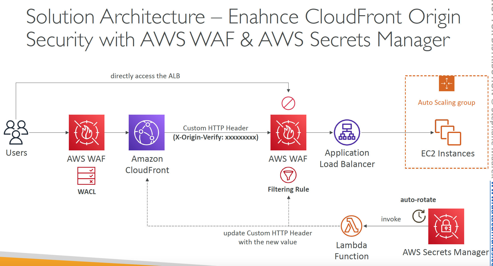

# Lesson 32: AWS Web Application Firewall - WAF

## Demo 32: Enhanced CloudFront Origin Security with AWS WAF & AWS Secrets Manager

### Description
We have a CloudFront Distribution in front of an Application Load Balancer ALB that distributes traffic to a target group of EC2 Instance.  
We want to ensure that only traffic coming from the CF distribution is allowed to access the ALB and not side traffic is allowed the access the endpoint of the ALB.  
To achieve this, we set a custom HTTP header `x-origin-verify: xxxxxx` on the request coming from the CF distribution and then we configure a WAF on the ALB to validate the custom header.  
Any request that does not have the correct header will be rejected.  
The value of the `x-origin-verify` header will be a secret that can be rotated regularly using SecretsManager or ParameterStore parameter. And then updated on the CloudFront and the WAF filtering rule.   



### Operation

**Deployment**  
Lint the template

```bash
$ cfn-lint Parameters.yaml
```

Deploy the stack

```bash
$ aws cloudformation deploy --template-file SslOnEc2.yaml  --stack-name Parameters
```

**After Deployment**

Go the the Parameter Store Console > Select the Advanced Parameter (`/demo-29/username`) > Policies

**Testing**

**Debug Errors**  
In the case of error during deployment, checkout the stack events

```bash
$ aws cloudformation describe-stack-events --stack-name Parameters > events.json
```

**Cleanup**

To delete the stack

```bash
$ aws cloudformation delete-stack --stack-name Parameters
```
