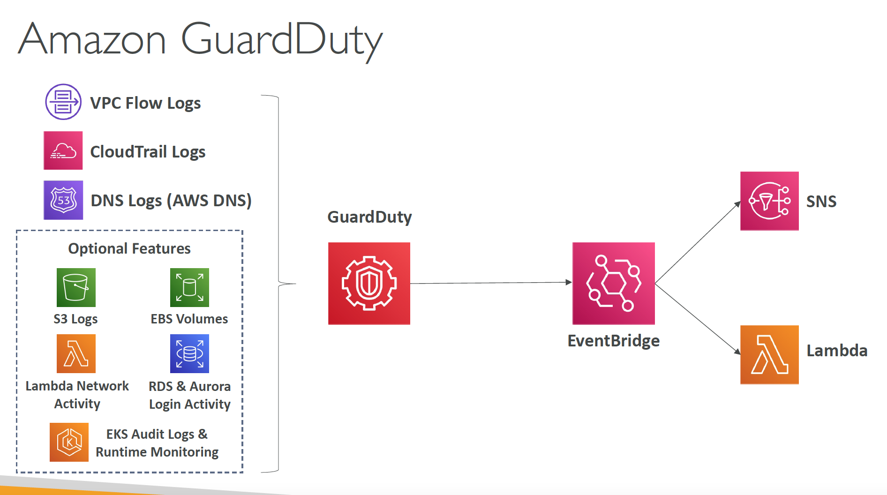
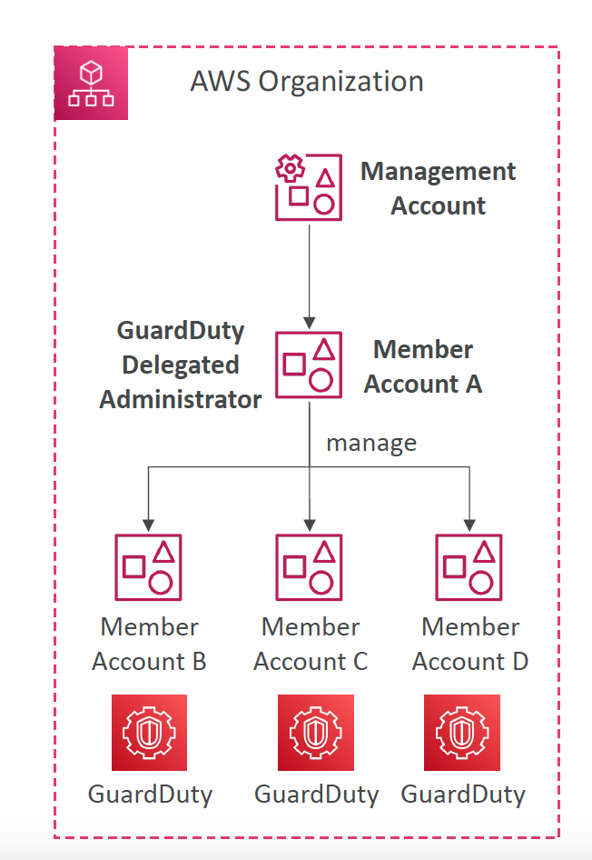

# Section 4: Security

## CloudTrail
__CloudTrail: How to react to events the fastest?__    
Overall, CloudTrail may take up to 15 minutes to deliver events
* __EventBridge:__
  - Can be triggered for any API call in CloudTrail
  - The fastest, most reactive way
* __CloudTrail Delivery in CloudWatch Logs:__
  - Events are streamed
  - Can perform a metric filter to analyze occurrences and detect anomalies
* __CloudTrail Delivery in S3:__
  - Events are delivered every 5 minutes
  - Possibility of analyzing logs integrity, deliver cross account, long-term storage

## AWS KMS
#### KMS – KMS Key Types
* __Symmetric (AES-256 keys)__  
  - First offering of KMS, single encryption key that is used to Encrypt and Decrypt
  - AWS services that are integrated with KMS use Symmetric KMS keys
  - Necessary for envelope encryption
  - You never get access to the KMS key unencrypted (must call KMS API to use)
* __Asymmetric (RSA & ECC key pairs)__
  - Public (Encrypt) and Private Key (Decrypt) pair
  - Used for Encrypt/Decrypt, or Sign/Verify operations
  - The public key is downloadable, but you can’t access the Private Key unencrypted
  - Use case: encryption outside of AWS by users who can’t call the KMS API

#### Types of KMS Keys
* __Customer Managed Keys__
  - Create, manage and use, can enable or disable
  - Possibility of rotation policy (new key generated every year, old key preserved)
  - Can add a Key Policy (resource policy) & audit in CloudTrail
  - Leverage for envelope encryption
* __AWS Managed Keys__  
  - Used by AWS service (`aws/s3`, `aws/ebs`, `aws/redshift`)
  - Managed by AWS (automatically rotated every 1 year)
  - View Key Policy & audit in CloudTrail
* __AWS Owned Keys__
  - Created and managed by AWS, use by some AWS services to protect your resources
  - Used in multiple AWS accounts, but they are not in your AWS account
  - You can’t view, use, track, or audit

#### KMS Key Material Origin
* Identifies the source of the key material in the KMS key
* Can’t be changed after creation
* __KMS (AWS_KMS)__ – default
  - AWS KMS creates and manages the key material in its own key store
* __External (EXTERNAL)__
  - You import the key material into the KMS key
  - You’re responsible for securing and managing this key material outside of AWS
* __Custom Key Store (AWS_CLOUDHSM)__
  - AWS KMS creates the key material in a custom key store (CloudHSM Cluster)

#### KMS Multi-Region Keys
* A set of identical KMS keys in different AWS Regions that can be used interchangeably (~ same KMS key in multiple Regions)
* Encrypt in one Region and decrypt in other Regions (No need to re-encrypt or making cross-Region API calls)
* Multi-Region keys have the same key ID, key material, automatic rotation, …
* KMS Multi-Region are NOT global (Primary + Replicas)
* Each Multi-Region key is managed independently
* Only one primary key at a time, can promote replicas into their own primary
* Use cases: Disaster Recovery, Global Data Management (e.g., DynamoDB Global Tables), Active-Active Applications that span multiple Regions, Distributed Signing applications, …

## Parameter Store
#### SSM Parameter Store Hierarchy
```txt
- /finance-department/
  - app-1/
    - dev/
      - db-url
      - db-password
    - prod/
      - db-url
      - db-password
  - app-2/
- /account-department/
```
You can reference a secret in SecretsManager through the Parameter Store:
```txt
/aws/reference/secretsmanager/secret_ID_in_Secrets_Manager
```
Public Parameters are publicly accessible parameters managed by AWS:
```txt
/aws/service/ami-amazon-linux-latest/amzn2-ami-hvm-x86_64-gp2 (public)
```

#### Standard and Advanced Parameter Tiers


## AWS Secrets Manager
#### Secrets Manager - Sharing Across Accounts
* There is not way to share secret across AWS accounts using Resource Access Manager (RAM).
* To share a secret across AWS account we using secret Resource Bases Policy.  


#### SSM Parameter Store vs Secrets Manager
* __Secrets Manager ($$$):__
  - Automatic rotation of secrets with AWS Lambda
  - Lambda function is provided for RDS, Redshift, DocumentDB
  - KMS encryption is mandatory
  - Can integration with CloudFormation
* __SSM Parameter Store ($):__
- Simple API
- No secret rotation (can enable rotation using Lambda triggered by EventBridge)
- KMS encryption is optional
- Can integration with CloudFormation
- Can pull a Secrets Manager secret using the SSM Parameter Store API

#### RDS Security
* KMS encryption at rest for underlying EBS volumes / snapshots
* _Transparent Data Encryption (TDE)_ for Oracle and SQL Server
* SSL encryption to RDS is possible for all DB (in-flight)
* IAM authentication for MySQL, PostgreSQL and MariaDB
* Authorization still happens within RDS (not in IAM)
* Can copy an un-encrypted RDS snapshot into an encrypted one
* CloudTrail cannot be used to track queries made within RDS

## SSL/TLS - Basics
#### SSL – Man in the Middle Attack
__How to prevent__
1. Don’t use public-facing HTTP, use HTTPS (meaning, use SSL/TLS certificates)
2. Use a DNS that has DNSSEC
  * To send a client to a pirate server, a DNS response needs to be “forged” by a server which intercepts them
  * It is possible to protect your domain name by configuring DNSSEC
  * _Amazon Route 53 supports DNSSEC for domain registration._
  * _Route 53 supports DNSSEC for DNS service as of December 2020 (using KMS)_
  * You could also run a custom DNS server on Amazon EC2 for example (Bind is the most popular, dnsmasq, KnotDNS, PowerDNS).

## CloudHSM
__Introduction__  
* KMS => AWS manages the software for encryption
* CloudHSM => AWS provisions encryption hardware
* Dedicated Hardware (HSM = Hardware Security Module)
* You manage your own encryption keys entirely (not AWS)
* HSM device is tamper resistant, FIPS 140-2 Level 3 compliance
* Supports both symmetric and asymmetric encryption (SSL/TLS keys)
* No free tier available
* Must use the CloudHSM Client Software
* Redshift supports CloudHSM for database encryption and key management
* Good option to use with SSE-C encryption

#### CloudHSM vs KMS


## S3 Security
[Examples of Amazon S3 bucket policies](https://docs.aws.amazon.com/AmazonS3/latest/userguide/example-bucket-policies.html)


## Distributed Denial of Service (DDoS)
#### Type of Attacks on your infrastructure
* Distributed Denial of Service (DDoS):
  - When your service is unavailable because it’s receiving too many requests
  - _SYN Flood (Layer 4):_ send too many TCP connection requests
  - _UDP Reflection (Layer 4):_ get other servers to send many big UDP requests
  - _DNS flood attack:_ overwhelm the DNS so legitimate users can’t find the site
  - _Slow Loris attack:_ a lot of HTTP connections are opened and maintained
* Application level attacks:
  - more complex, more specific (HTTP level)
  - Cache bursting strategies: overload the backend database by invalidating cache

#### DDoS Protection on AWS
* __AWS Shield Standard:__ protects against DDoS attack for your website and applications, for all customers at no additional costs
* __AWS Shield Advanced:__ 24/7 premium DDoS protection
* __AWS WAF:__ Filter specific requests based on rules
* __CloudFront and Route 53:__
  - Availability protection using global edge network
  - Combined with AWS Shield, provides DDoS attack mitigation at the edge
* Be ready to scale – leverage AWS Auto Scaling
* Separate static resources (S3 / CloudFront) from dynamic ones (EC2 / ALB)
* Read the white paper for details: https://d1.awsstatic.com/whitepapers/Security/DDoS_White_Paper.pdf

#### AWS Shield
* __AWS Shield Standard:__  
  - Free service that is activated for every AWS customer
  - Provides protection from attacks such as SYN/UDP Floods, Reflection attacks and other layer 3/layer 4 attacks
* __AWS Shield Advanced:__
  - Optional DDoS mitigation service ($3,000 per month per organization)
  - Protect against more sophisticated attack on Amazon EC2, Elastic Load Balancing (ELB), Amazon CloudFront, AWS Global Accelerator, Route 53
  - 24/7 access to AWS DDoS response team (DRP)
  - Protect against higher fees during usage spikes due to DDoS

#### AWS WAF – Web Application Firewall
* Protects your web applications from common web exploits (Layer 7)
* Deploy on __Application Load Balancer__ (localized rules)
* Deploy on __API Gateway__ (rules running at the regional or edge level)
* Deploy on __CloudFront__ (rules globally on edge locations)
  - Used to front other solutions: CLB, EC2 instances, custom origins, S3 websites
* Deploy on AppSync (protect your GraphQL APIs)
* _WAF is not for DDoS protection_
* Define Web ACL (Web Access Control List):
  - Rules can include __IP addresses__, HTTP headers, HTTP body, or URI strings
  - Protects from common attack - __SQL injection__ and _Cross-Site Scripting (XSS)_
  - Size constraints, Geo match
  - Rate-based rules (to count occurrences of events)
* Rule Actions: Count | Allow | Block | CAPTCHA | Challenge

#### AWS WAF – Managed Rules
* Library of over 190 managed rules
* Ready-to-use rules that are managed by AWS and AWS Marketplace Sellers
* __Baseline Rule Groups__ – general protection from common threats
  - AWSManagedRulesCommonRuleSet
  - AWSManagedRulesAdminProtectionRuleSet, etc
* __Use-case Specific Rule Groups__ – protection for many AWS WAF use cases
  - AWSManagedRulesSQLiRuleSet,
  - AWSManagedRulesWindowsRuleSet,
  - AWSManagedRulesPHPRuleSet,
  - AWSManagedRulesWordPressRuleSet, etc
* __IP Reputation Rule Groups__ – block requests based on source (e.g., malicious
IPs)
  - AWSManagedRulesAmazonIpReputationList,   
  - AWSManagedRulesAnonymousIpList
* __Bot Control Managed Rule Group__ – block and manage requests from bots
  - AWSManagedRulesBotControlRuleSet

#### WAF - Web ACL – Logging
* You can send your logs to an:
  - Amazon CloudWatch Logs log group – 5 MB per second
  - Amazon Simple Storage Service (Amazon S3) bucket – 5 minutes interval
  - Amazon Kinesis Data Firehose – limited by Firehose quotas


#### AWS Firewall Manager
* __Manage rules in all accounts of an AWS Organization__
* Security policy: common set of security rules
  - WAF rules (Application Load Balancer, API Gateways, CloudFront)
  - AWS Shield Advanced (ALB, CLB, NLB, Elastic IP, CloudFront)
  - Security Groups for EC2, Application Load Balancer and ENI resources in VPC
  - AWS Network Firewall (VPC Level)
  - Amazon Route 53 Resolver DNS Firewall
  - Policies are created at the region level
* _Rules are applied to new resources as they are created (good for compliance) across all and future accounts in your Organization_

#### WAF vs. Firewall Manager vs. Shield
* _WAF, Shield and Firewall Manager are used together for comprehensive protection_
* Define your Web ACL rules in WAF
* For granular protection of your resources, WAF alone is the correct choice
* If you want to use AWS WAF across accounts, accelerate WAF configuration, automate the protection of new resources, use Firewall Manager with AWS WAF
* Shield Advanced adds additional features on top of AWS WAF, such as dedicated support from the Shield Response Team (SRT) and advanced reporting.
* If you’re prone to frequent DDoS attacks, consider purchasing Shield Advanced

#### Amazon Inspector
* Automated Security Assessments
* __For EC2 instances__
  - Leveraging the _AWS System Manager (SSM) agent_
  - Analyze against _unintended network accessibility_
  - Analyze the _running OS_ against known vulnerabilities
* __For Container Images push to Amazon ECR__
  - Assessment of Container Images as they are pushed
* __For Lambda Functions__
  - Identifies software vulnerabilities in function code and package dependencies
  - Assessment of functions as they are deployed
* Reporting & integration with _AWS Security Hub_
* Send findings to _Amazon Event Bridge_

__What does Amazon Inspector evaluate?__   
* _Remember: only for EC2 instances, Container Images & Lambda functions_
* Continuous scanning of the infrastructure, only when needed
* Package vulnerabilities (EC2, ECR & Lambda) – database of CVE
* Network reachability (EC2)
* A risk score is associated with all vulnerabilities for prioritization

#### AWS Managed Logs
* __Load Balancer Access Logs(ALB, NLB, CLB)__  => to S3
  - Access logs for your Load Balancers
* __CloudTrail Logs__ => to S3 and CloudWatch Logs
  - Logs for API calls made within your account
* __VPC Flow Logs__ => to S3, CloudWatch Logs, Kinesis Data Firehose
  - Information about IP traffic going to and from network interfaces in yourVPC
* __Route 53 Access Logs__ => to CloudWatch Logs
  - Log information about the queries that Route 53 receives
* __S3 Access Logs__ => to S3
  - Server access logging provides detailed records for the requests that are made to a bucket
* __CloudFront Access Logs__ => to S3
  - Detailed information about every user request that CloudFront receives
* __AWS Config__ => to S3


#### Amazon GuardDuty
* Intelligent Threat discovery to protect your AWS Account
* Uses Machine Learning algorithms, anomaly detection, 3rd party data
* One click to enable (30 days trial), no need to install software
* Input data includes:
  - __CloudTrail Events Logs__ – unusual API calls, unauthorized deployments
    * __CloudTrail Management Events__ – create VPC subnet, create trail, …
    * __CloudTrail S3 Data Events__ – get object, list objects, delete object, …
  - __VPC Flow Logs__ – unusual internal traffic, unusual IP address
  - __DNS Logs__ – compromised EC2 instances sending encoded data within DNS queries
  - __Optional Feature__ – EKS Audit Logs, RDS & Aurora, EBS, Lambda, S3 Data Events…
* Can setup __EventBridge rules__ to be notified in case of findings
* EventBridge rules can target AWS Lambda or SNS
* _Can protect against CryptoCurrency attacks (has a dedicated “finding” for it)_



#### GuardDuty – Delegated Administrator
* AWS Organization member accounts can be
designated to be a GuardDuty Delegated
Administrator
* Have full permissions to enable and manage
GuardDuty for all accounts in the
Organization
* Can be done only using the Organization
Management Account


## IAM Conditions
__aws:SourceIp__:  restricts the client IP _from_ which the API calls are being made

```JSON
{
  "Version": "2012-10-17",
  "Statement": [
    {
      "Effect": "Deny",
      "Action": "*",
      "Resource": "*",
      "Condition": {
        "NotIpAddress": {
          "aws:SourceIp": ["192.0.2.0/24", "203.0.113.0/24"]
        }
      }
    }
  ]
}
```

__aws:RequestedRegion__: restrict the region the API calls are made _to_

```JSON
{
  "Version": "2012-10-17",
  "Statement": [
    {
      "Effect": "Deny",
      "Action": ["ec2:*", "rds:*", "dynamodb:*"],
      "Resource": "*",
      "Condition": {
        "StringEquals": {
          "aws:RequestedRegion": ["eu-central-1", "eu-west-1"]
        }
      }
    }
  ]
}
```
__ec2:ResourceTag__: restrict based on _tags_ .

```JSON
{
  "Version": "2012-10-17",
  "Statement": [
    {
      "Effect": "Allow",
      "Action": ["ec2:startInstances", "ec2:StoopInstances"],
      "Resource": "arn:aws:ec2:us-east-1:123456789:instance/*",
      "Condition": {
        "StringEquals": {
          "ec2:ResourceTag/Project": "DataAnalytics",
          "aws:PrincipalTag/Department": "Data"
        }
      }
    }
  ]
}
```
Allows only EC2 resources with the ResourceTag named `Project=DataAnalytics` and the IAM principal (user or role) creating the resource must have tag `Department=Data`.  

__aws:MultiFactorAuthPresent__: to force _MFA_

```JSON
{
  "Version": "2012-10-17",
  "Statement": [
    {
      "Effect": "Allow",
      "Action": "ec2:*",
      "Resource": "*"      
    },
    {
      "Effect": "Deny",
      "Action": ["ec2:StartInstances", "ec2:TerminateInstanes"],
      "Resource": "*",
      "Condition": {
        "BoolIfExists": {
          "aws:MultiFactorAuthPresent": false
        }
      }
    }
  ]
}
```

#### Resource Policies & aws:PrincipalOrgID
* __aws:PrincipalOrgID__ can be used in any resource policies to restrict access to accounts that are member of an AWS Organization
```JSON
{
  "Version": "2012-10-17",
  "Statement": [
    {
      "Effect": "Allow",
      "Action": ["s3:PutObject", "s3:GetObject"],
      "Resource": "arn:aws:s3:::2022-financial-data/*",
      "Condition": {
        "StringEquals": {
          "aws:PrincipalOrgID": ["o-yyyyyyy"]
        }
      }
    }
  ]
}
```  
Allows only member accounts from the organization to access the S3 bucket.

#### EC2 Instance Connect (SendSSHPublicKey API)
EC2 instance connect works when you add an _Inbound Rule_ to your security group that permits SSH access to _AWS IP Range_.  
See the list of IP ranged [here](https://ip-ranges.amazonaws.com/ip-ranges.json).  

When you security group have the appropriate SSH permission, EC2 instance connect then uses the `SendSSHPublicKey` API to push a one-time SSH public key that is valid for 60 seconds.

You can do the same for you EC2 instances by using the `SendSSHPublicKey` API to push a public key to the EC2 instance and then use the private key to connect.  

#### AWS Security Hub
* __Central security tool__ to manage security _across several AWS accounts_ and _automate security checks_
* Integrated dashboards showing current security and compliance status to quickly take
actions
* Automatically aggregates alerts in predefined or personal findings formats from various
AWS services & AWS partner tools:
  - Config
  - GuardDuty
  - Inspector
  - Macie
  - IAM Access Analyzer
  - AWS Systems Manager
  - AWS Firewall Manager
  - AWS Health
  - AWS Partner Network Solutions
* Must first enable the AWS Config Service

#### Amazon Detective
* GuardDuty, Macie, and Security Hub are used to identify potential
security issues, or findings
* Sometimes security findings require deeper analysis to isolate the root
cause and take action – it’s a complex process
* Amazon Detective _analyzes, investigates, and quickly identifies the root cause of security issues or suspicious activities (using ML and graphs)_
* _Automatically collects and processes events_ from VPC Flow Logs, CloudTrail, GuardDuty and create a unified view
* Produces visualizations with details and context to get to the root cause
