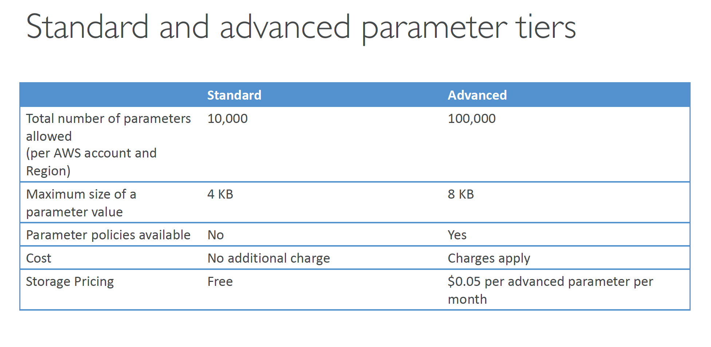
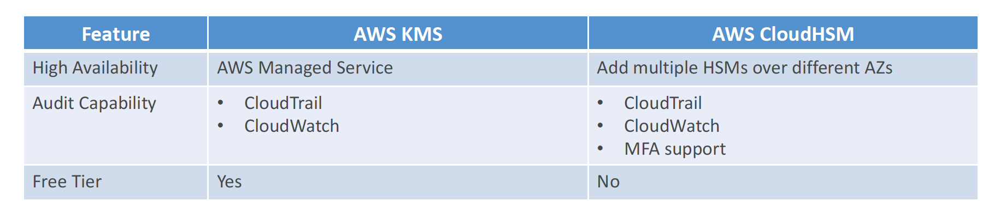

# Section 4: Security

## CloudTrail
__CloudTrail: How to react to events the fastest?__    
Overall, CloudTrail may take up to 15 minutes to deliver events
* __EventBridge:__
  - Can be triggered for any API call in CloudTrail
  - The fastest, most reactive way
* __CloudTrail Delivery in CloudWatch Logs:__
  - Events are streamed
  - Can perform a metric filter to analyze occurrences and detect anomalies
* __CloudTrail Delivery in S3:__
  - Events are delivered every 5 minutes
  - Possibility of analyzing logs integrity, deliver cross account, long-term storage

## AWS KMS
#### KMS – KMS Key Types
* __Symmetric (AES-256 keys)__  
  - First offering of KMS, single encryption key that is used to Encrypt and Decrypt
  - AWS services that are integrated with KMS use Symmetric KMS keys
  - Necessary for envelope encryption
  - You never get access to the KMS key unencrypted (must call KMS API to use)
* __Asymmetric (RSA & ECC key pairs)__
  - Public (Encrypt) and Private Key (Decrypt) pair
  - Used for Encrypt/Decrypt, or Sign/Verify operations
  - The public key is downloadable, but you can’t access the Private Key unencrypted
  - Use case: encryption outside of AWS by users who can’t call the KMS API

#### Types of KMS Keys
* __Customer Managed Keys__
  - Create, manage and use, can enable or disable
  - Possibility of rotation policy (new key generated every year, old key preserved)
  - Can add a Key Policy (resource policy) & audit in CloudTrail
  - Leverage for envelope encryption
* __AWS Managed Keys__  
  - Used by AWS service (`aws/s3`, `aws/ebs`, `aws/redshift`)
  - Managed by AWS (automatically rotated every 1 year)
  - View Key Policy & audit in CloudTrail
* __AWS Owned Keys__
  - Created and managed by AWS, use by some AWS services to protect your resources
  - Used in multiple AWS accounts, but they are not in your AWS account
  - You can’t view, use, track, or audit

#### KMS Key Material Origin
* Identifies the source of the key material in the KMS key
* Can’t be changed after creation
* __KMS (AWS_KMS)__ – default
  - AWS KMS creates and manages the key material in its own key store
* __External (EXTERNAL)__
  - You import the key material into the KMS key
  - You’re responsible for securing and managing this key material outside of AWS
* __Custom Key Store (AWS_CLOUDHSM)__
  - AWS KMS creates the key material in a custom key store (CloudHSM Cluster)

#### KMS Multi-Region Keys
* A set of identical KMS keys in different AWS Regions that can be used interchangeably (~ same KMS key in multiple Regions)
* Encrypt in one Region and decrypt in other Regions (No need to re-encrypt or making cross-Region API calls)
* Multi-Region keys have the same key ID, key material, automatic rotation, …
* KMS Multi-Region are NOT global (Primary + Replicas)
* Each Multi-Region key is managed independently
* Only one primary key at a time, can promote replicas into their own primary
* Use cases: Disaster Recovery, Global Data Management (e.g., DynamoDB Global Tables), Active-Active Applications that span multiple Regions, Distributed Signing applications, …

## Parameter Store
#### SSM Parameter Store Hierarchy
```txt
- /finance-department/
  - app-1/
    - dev/
      - db-url
      - db-password
    - prod/
      - db-url
      - db-password
  - app-2/
- /account-department/
```
You can reference a secret in SecretsManager through the Parameter Store:
```txt
/aws/reference/secretsmanager/secret_ID_in_Secrets_Manager
```
Public Parameters are publicly accessible parameters managed by AWS:
```txt
/aws/service/ami-amazon-linux-latest/amzn2-ami-hvm-x86_64-gp2 (public)
```

#### Standard and Advanced Parameter Tiers


## AWS Secrets Manager
#### Secrets Manager - Sharing Across Accounts
* There is not way to share secret across AWS accounts using Resource Access Manager (RAM).
* To share a secret across AWS account we using secret Resource Bases Policy.  


#### SSM Parameter Store vs Secrets Manager
* __Secrets Manager ($$$):__
  - Automatic rotation of secrets with AWS Lambda
  - Lambda function is provided for RDS, Redshift, DocumentDB
  - KMS encryption is mandatory
  - Can integration with CloudFormation
* __SSM Parameter Store ($):__
- Simple API
- No secret rotation (can enable rotation using Lambda triggered by EventBridge)
- KMS encryption is optional
- Can integration with CloudFormation
- Can pull a Secrets Manager secret using the SSM Parameter Store API

#### RDS Security
* KMS encryption at rest for underlying EBS volumes / snapshots
* _Transparent Data Encryption (TDE)_ for Oracle and SQL Server
* SSL encryption to RDS is possible for all DB (in-flight)
* IAM authentication for MySQL, PostgreSQL and MariaDB
* Authorization still happens within RDS (not in IAM)
* Can copy an un-encrypted RDS snapshot into an encrypted one
* CloudTrail cannot be used to track queries made within RDS

## SSL/TLS - Basics
#### SSL – Man in the Middle Attack
__How to prevent__
1. Don’t use public-facing HTTP, use HTTPS (meaning, use SSL/TLS certificates)
2. Use a DNS that has DNSSEC
  * To send a client to a pirate server, a DNS response needs to be “forged” by a server which intercepts them
  * It is possible to protect your domain name by configuring DNSSEC
  * _Amazon Route 53 supports DNSSEC for domain registration._
  * _Route 53 supports DNSSEC for DNS service as of December 2020 (using KMS)_
  * You could also run a custom DNS server on Amazon EC2 for example (Bind is the most popular, dnsmasq, KnotDNS, PowerDNS).

## CloudHSM
__Introduction__  
* KMS => AWS manages the software for encryption
* CloudHSM => AWS provisions encryption hardware
* Dedicated Hardware (HSM = Hardware Security Module)
* You manage your own encryption keys entirely (not AWS)
* HSM device is tamper resistant, FIPS 140-2 Level 3 compliance
* Supports both symmetric and asymmetric encryption (SSL/TLS keys)
* No free tier available
* Must use the CloudHSM Client Software
* Redshift supports CloudHSM for database encryption and key management
* Good option to use with SSE-C encryption

#### CloudHSM vs KMS



## S3 Security
[Examples of Amazon S3 bucket policies](https://docs.aws.amazon.com/AmazonS3/latest/userguide/example-bucket-policies.html)
