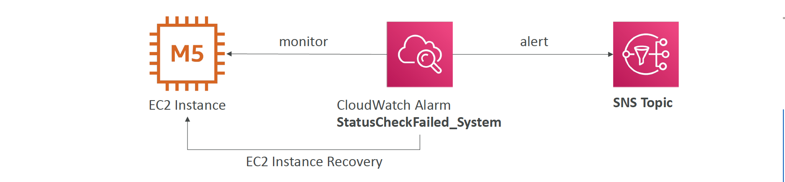

# Section 5: Compute and Load Balancing

## EC2
#### EC2 Instance Type Family – Main ones
* R: applications that needs a lot of RAM – in-memory caches
* C: applications that needs good CPU – compute / databases
* M: applications that are balanced (think “medium”) – general / web app
* I: applications that need good local I/O (instance storage) – databases
* G: applications that need a GPU – video rendering / machine learning
* T2 / T3: burstable instances (up to a capacity)
* T2 / T3 - unlimited: unlimited burst
* Real-world tip: use https://www.ec2instances.info

#### EC2 - Placement Groups
__Group Strategies__
* __Cluster__ — clusters instances into a low-latency group in a single Availability Zone
* __Spread__ — spreads instances across underlying hardware _(max 7 instances per group per AZ)_ – critical applications
* __Partition__ —spreads instances across many different partitions (which rely on different sets
of racks) within an AZ. _Up to 7 partitions per AZ_. Scales to 100s of EC2 instances per group (Hadoop, Cassandra,
Kafka)

__Moving instance between placement groups__  
* You can move an instance into or out of a placement group
  - Your first need to stop it
  - You then need to use the CLI (modify-instance-placement)
  - You can then start your instance

__Placements Groups Partition__  
* Up to 7 partitions per AZ
* Up to 100s of EC2 instances
* The instances in a partition do not share racks with the instances in the other partitions
* A partition failure can affect many EC2 but won’t affect other partitions
* EC2 instances get access to the partition information as metadata
* Use cases: HDFS, HBase, Cassandra, Kafka

#### EC2 Graviton
* AWS Graviton Processors deliver the best price performance
* Supports many Linux OS, Amazon Linux 2, RedHat, SUSE, Ubuntu
* _Not available for Windows instances_
* __Graviton2__ – _40% better_ price performance over comparable 5th generation x86-based instances
* __Graviton3__ – Up to _3x better_ performance compared to Graviton2
* Use cases: app servers, microservices, HPC, CPU-based ML, video encoding, gaming, in-memory caches, etc.

#### EC2 included metrics
* CPU: CPU Utilization + Credit Usage / Balance
* Network: Network In / Out
* Status Check:
  - Instance status = check the EC2 VM
  - System status = check the underlying hardware
* Disk: Read / Write for Ops / Bytes (only for instance store)
* _RAM is NOT included in the AWS EC2 metrics_

#### EC2 Instance Recovery
* Status Check:
  - Instance status = check the EC2 VM
  - System status = check the underlying hardware
* Recovery: Same Private, Public, Elastic IP, metadata, placement group

You can setup a CloudWatch Alarm to monitor the status checks (`StatusCheckFailed_System`, `StatusCheckFailed_Instance`) and perform an EC2 _Instance Recovery_ Action if your instance fails.  
You can even have the CloudWatch alarm send an SNS notification after you instance has been recovered.   

### High Performance Computing (HPC)
__Data Management & Transfer__  
* __AWS Direct Connect:__
  - Move GB/s of data to the cloud, over a private secure network
* __Snowball__
  - Move PB of data to the cloud
* __AWS DataSync__  
  - Move large amount of data between on-premise and S3, EFS, FSx for Windows

__Compute and Networking__  
* EC2 Instances:
  - CPU optimized, GPU optimized
  - Spot Instances / Spot Fleets for cost savings + Auto Scaling
* EC2 Placement Groups: Cluster for good network performance
* __EC2 Enhanced Networking (SR-IOV)__  
  - Higher bandwidth, higher PPS (packet per second), lower latency
  - Option 1: _Elastic Network Adapter (ENA)_ up to 100 Gbps
  - Option 2: Intel 82599 VF up to 10 Gbps – LEGACY
*  __Elastic Fabric Adapter (EFA)__  
  - Improved ENA for HPC, only works for Linux
  - Great for inter-node communications, _tightly coupled workloads_
  - Leverages Message Passing Interface (MPI) standard
  - Bypasses the underlying Linux OS to provide low-latency, reliable transport

__Storage__   
* Instance-attached storage:
  - __EBS__: scale up to _256,000 IOPS_ with io2 Block Express
  - __Instance Store__: scale to _millions of IOPS_, linked to EC2 instance, low latency
* Network storage:
  - __Amazon S3__: large blob, not a file system
  - __Amazon EFS__: scale IOPS based on total size, or use provisioned IOPS
  - __Amazon FSx for Lustre__:
    * HPC optimized distributed file system, millions of IOPS
    * Backed by S3

__Automation and Orchestration__   
* AWS Batch
  - __AWS Batch__ supports multi-node parallel jobs, which enables you to run single jobs that span multiple EC2 instances.
  - Easily schedule jobs and launch __EC2__ instances accordingly
* AWS ParallelCluster
  - Open source cluster management tool to deploy HPC on AWS
  - Configure with text files
  - Automate creation of VPC, Subnet, cluster type and instance types

#### Auto Scaling
__Good metrics to scale on__   
* __CPUUtilization__: Average CPU utilization across your instances
* __RequestCountPerTarget__: to make sure the number of requests per EC2 instances is stable
* __Average Network In / Out__ (if you’re application is network bound)
* __Any custom metric__ (that you push using CloudWatch)

__Auto Scaling – Good to know__
* __Spot Fleet support__ (mix on Spot and On-Demand instances)
* __Lifecycle Hooks__:
  - Perform actions before an instance is in service, or before it is terminated
  - Examples: cleanup, log extraction, special health checks
* To upgrade an AMI, must update the launch configuration / template
  - Then terminate instances manually (CloudFormation can help)
  - Or use EC2 Instance Refresh for Auto Scaling

__Auto Scaling – Scaling Processes__  
* __Launch__: Add a new EC2 to the group, increasing the capacity
* __Terminate__: Removes an EC2 instance from the group, decreasing its capacity.
* __HealthCheck__: Checks the health of the instances
* __ReplaceUnhealthy__: Terminate unhealthy instances and re-create them
* __AZRebalance__: Balancer the number of EC2 instances across AZ
* __AlarmNotification__: Accept notification from CloudWatch
* __ScheduledActions__: Performs scheduled actions that you create.
* __AddToLoadBalancer__: Adds instances to the load balancer or target group
* __InstanceRefresh__: Perform an instance refresh

We can suspend these processes!

__Auto Scaling – Health Checks__  
* Health checks available:
  - EC2 Status Checks
  - ELB Health Checks (HTTP)
  - Custom Health Checks – send instance’s health to an ASG using AWS CLI or AWS SDK (`set-instance-health`)

__EC2 Spot Instances__  
If the current spot price > your max price you can choose to _stop_ or _terminate_ your instance with a _2 minutes grace period_

__Spot Fleets__  
* Spot Fleets = set of Spot Instances + (optional) On-Demand Instances
* The Spot Fleet will try to meet the target capacity with price constraints
  - Define possible launch pools: instance type (m5.large), OS, Availability Zone
  - Can have multiple launch pools, so that the fleet can choose
  - Spot Fleet stops launching instances when reaching capacity or max cost
* Strategies to allocate Spot Instances:
  - __lowestPrice__: from the pool with the lowest price (cost optimization, short workload)
  - __diversified__: distributed across all pools (great for availability, long workloads)
  - __capacityOptimized__: pool with the optimal capacity for the number of instances
  - __priceCapacityOptimized (recommended)__: pools with highest capacity available, then select the pool with the lowest price (best choice for most workloads)
* Spot Fleets allow us to automatically request Spot Instances with the lowest price

## Amazon ECS
__Amazon ECS – Security & Networking__  
* You can inject secrets and configurations as Environment Variables into
running Docker containers
  - Integration with _SSM Parameter Store_ and _Secrets Manager_
* ECS Tasks Networking
  - __none__ – no network connectivity, no port mappings
  - __bridge__ – uses Docker’s virtual container-based network
  - __host__ – bypass Docker’s network, uses the underlying host network interface
  - __awsvpc__
    * Every tasks launched on the instance gets its own ENI and a private IP address
    * Simplified networking, enhanced security, Security Groups, monitoring, VPC Flow Logs
    * Default mode for Fargate tasks

__Amazon ECS – Service Auto Scaling__  
* Automatically increase/decrease the desired number of tasks
* Amazon ECS leverages __AWS Application Auto Scaling__
* CPU and RAM is tracked in CloudWatch at the ECS Service level
* __Target Tracking__ – scale based on target value for a specific CloudWatch metric
* __Step Scaling__ – scale based on a specified CloudWatch Alarm
* __Scheduled Scaling__ – scale based on a specified date/time (predictable changes)
* ECS Service Auto Scaling (task level) ≠ EC2 Auto Scaling (EC2 instance level)
* Fargate Auto Scaling is much easier to setup (because Serverless)

__Amazon ECS – Spot Instances__  
* __ECS Classic (EC2 Launch Type)__  
  - Can have the underlying EC2 instances as Spot Instances (managed by an ASG)
  - Instances may go into draining mode to remove running tasks
  - Good for cost savings, but will impact reliability
* __AWS Fargate__  
  - Specify minimum of tasks for on-demand baseline workload
  - Add tasks running on _FARGATE_SPOT_ for cost-savings (can be reclaimed by AWS)
  - Regardless of On-demand or Spot, Fargate scales well based on load

## Amazon ECR
__Amazon ECR – Cross Region Replication__
* ECR private registry supports both _cross-region_ and _cross-account_ replication

__Amazon ECR – Image Scanning__   
* Manual Scan or Scan on Push
* Basic Scanning – Common CVE
* Enhanced Scanning – Leverages Amazon Inspector (OS & Programming Language vulnerabilities)
* Scan results can be retrieved from within the AWS console

## Amazon EKS
__Amazon EKS Overview__  
* EKS supports _EC2_ if you want to deploy worker nodes or _Fargate_ to deploy serverless containers
* Collect logs and metrics using __CloudWatch Container Insights__  

__Amazon EKS – Node Types__  
* __Managed Node Groups__
  - Creates and manages Nodes (EC2 instances) for you
  - Nodes are part of an ASG managed by EKS
  - Supports On-Demand or Spot Instances
* __Self-Managed Nodes__
  - Nodes created by you and registered to the EKS cluster and managed by an ASG
  - You can use prebuilt AMI - Amazon EKS Optimized AMI
  - Supports On-Demand or Spot Instances
* __AWS Fargate__
  - No maintenance required; no nodes managed

__Amazon EKS – Data Volumes__  
* Need to specify _StorageClass_ manifest on your EKS cluster
* Leverages a _Container Storage Interface (CSI)_ compliant driver
* Support for…
  - Amazon EBS
  - Amazon EFS (works with Fargate)
  - Amazon FSx for Lustre
  - Amazon FSx for NetApp ONTAP

__Amazon ECS Anywhere__  
* Easily run containers on Customer-managed infrastructure (on-premises, VMs, …)
* Allows customers to deploy native Amazon ECS tasks in any environment
* Fully-managed Amazon ECS Control Plane
* __ECS Container Agent__ and __SSM Agent__ needs to be installed
* _“EXTERNAL”_ Launch Type
* _Must have a stable connection to the AWS Region_
* Use cases:
  - Meet compliance, regulatory, and latency requirements
  - Run apps outside AWS Regions and closer to their other services
  - On-premises ML, video processing, data processing, …

__Amazon EKS Anywhere__  
* Create and operate Kubernetes clusters created outside AWS
* Leverage the __Amazon EKS Distro__ (AWS’ bundled release of Kubernetes)
* Reduce support costs and avoid maintaining redundant 3rd party tools
* Install using the __EKS Anywhere Installer__
* Optionally use the __EKS Connector__ to connect the EKS Anywhere clusters to AWS
  - _Fully Connected & Partially Disconnected_: you can connect to Amazon EKS Anywhere clusters to AWS, and leverage the EKS console
  - _Fully Disconnected_: must install the EKS Distro and leverage open-source tools to manage your clusters

## Lambda
__Lambda & CodeDeploy__  
* __CodeDeploy__ can help you automate traffic shift for Lambda aliases
* Feature is integrated within the SAM framework
* __Linear__: grow traffic every N minutes until 100%
  - Linear10PercentEvery3Minutes
  - Linear10PercentEvery10Minutes
* __Canary__: try X percent then 100%
  - Canary10Percent5Minutes
  - Canary10Percent30Minutes
* __AllAtOnce__: immediate
* Can create Pre & Post Traffic hooks to check the health of the Lambda function

## Elastic Load Balancer (ELB)
__Types of load balancer on AWS__  
* AWS has 4 kinds of managed Load Balancers
* __Classic Load Balancer__ (v1 - old generation) – 2009 – CLB
  - HTTP, HTTPS, TCP, SSL (secure TCP)
* __Application Load Balancer__ (v2 - new generation) – 2016 – ALB
  - HTTP, HTTPS, WebSocket
* __Network Load Balancer__ (v2 - new generation) – 2017 – NLB
  - TCP, TLS (secure TCP), UDP
* __Gateway Load Balancer__ – 2020 – GWLB
  - Operates at layer 3 (Network layer) – IP Protocol
* Overall, it is recommended to use the newer generation load balancers as they provide more features
* Some load balancers can be setup as internal (private) or external (public) ELBs

__Classic Load Balancers (v1)__  
* Health Checks can be HTTP (L7) or TCP (L4) based including with SSL
* Supports only one SSL certificate
  - The SSL certificate can have many SAN (Subject Alternate Name), but the SSL certificate must be changed anytime a SAN is added / edited / removed
  - Better to use ALB with SNI (Server Name Indication) if possible
  - Can use multiple CLB if you want distinct SSL certificates

__Application Load Balancer (v2)__  
* Application load balancers is Layer 7 (HTTP)
* Load balancing to multiple HTTP applications across machines (target groups)
* Load balancing to multiple applications on the same machine (ex: containers) – great fit with ECS, has dynamic port mapping
* Support for HTTP/2 and WebSocket
* Support redirects (from HTTP to HTTPS for example)
* Routing Rules for path, headers, query string

__Network Load Balancer (v2)__  
* Network load balancers (Layer 4) allow to:
  - Forward TCP & UDP traffic to your instances
  - Handle millions of request per seconds
  - Less latency ~100 ms (vs 400 ms for ALB)
* _NLB has one static IP per AZ, and supports assigning Elastic IP_ (helpful for whitelisting specific IP)
* NLB are used for extreme performance, TCP or UDP traffic
* Not included in the AWS free tie

__Network Load Balancer – Zonal DNS Name__  
* Resolving __Regional NLB DNS__ name returns the IP addresses for all NLB nodes in all enabled AZs
  - `my-nlb-1234567890abcdef.elb.us-east-1.amazon.aws.com`
* __Zonal DNS Name__
  - NLB has DNS names for each of its nodes
  - Use to determine the IP address of each node
  - `us-east-1a.my-nlb-1234567890abcdef.elb.us-east-1.amazon.aws.com`
  - Used to minimize latency and data transfer costs
  - You need to implement app specific logic

__Gateway Load Balancer__   
* Deploy, scale, and manage a fleet of 3rd party network virtual appliances in AWS
* Example: Firewalls, Intrusion Detection and Prevention Systems, Deep Packet Inspection Systems, payload manipulation, …
* Operates at Layer 3 (Network Layer) – IP Packets
* Combines the following functions:
  - __Transparent Network Gateway__ – single entry/exit for all traffic
  - __Load Balancer__ – distributes traffic to your virtual appliances
* Uses the GENEVE protocol on port 6081

__Cross-Zone Load Balancing__  
* __Classic Load Balancer__  
  - Disabled by default
  - No charges for inter AZ data if enabled
* __Application Load Balancer__   
  - Always on (can’t be disabled)
  - No charges for inter AZ data
* __Network Load Balancer__  
  - Disabled by default
  - You pay charges ($) for inter AZ data if enabled
* __Gateway Load Balancer__   
  - Disabled by default
  - You pay charges ($) for inter AZ data if enabled

__Sticky Sessions (Session Affinity)__  
* This works for Classic Load Balancers & Application Load Balancers
* The “cookie” used for stickiness has an expiration date you control

#### Request Routing Algorithms
1. __Least Outstanding Requests__  
  - The next instance to receive the request is the instance that has the lowest number of pending/unfinished requests
  - Works with _Application Load Balancer_ and _Classic Load Balancer_
2. __Round Robin__  
  - Equally choose the targets from the target group
  - Works with _Application Load Balancer_ and _Classic Load Balancer (TCP)_
3. __Flow Hash__  
  - Selects a target based on the protocol, source/destination IP address, source/destination port, and TCP sequence number
  - Each TCP/UDP connection is routed to a single target for the life of the connection
  - Works with Network Load Balancer

## API Gateway
__API Gateway - Endpoint Types__   
* __Edge-Optimized (default)__: For global clients
  - Requests are routed through the CloudFront Edge locations (improves latency)
  - The API Gateway still lives in only one region
* __Regional__:
  - For clients within the same region
  - Could manually combine with CloudFront (more control over the caching strategies and the distribution)
* __Private__:  
  - Can only be accessed from your VPC using an interface VPC endpoint (ENI)
  - Use a resource policy to define access

__Caching API responses__  
* Caching reduces the number of calls made to the backend
* Default TTL (time to live) is 300 seconds (min: 0s, max: 3600s)
* Caches are defined _per stage_
* Possible to override cache settings _per method_
* Clients can invalidate the cache with header: _Cache-Control: max-age=0_ (with proper IAM authorization)
* Able to flush the entire cache (invalidate it) immediately
* Cache encryption option
* Cache capacity between 0.5GB to 237GB

__API Gateway – Security__  
* Load SSL certificates and use Route53 to define a CNAME
* Resource Policy (~S3 Bucket Policy):
  - control who can access the API
  - Users from AWS accounts, IP or CIDR blocks, VPC or VPC Endpoints
* IAM Execution Roles for API Gateway at the API level
  - To invoke a Lambda Function, an AWS service…
* CORS (Cross-origin resource sharing):
  - Browser based security
  - Control which domains can call your API

__API Gateway – Authentication__  
* __IAM based access (AWS_IAM)__
  - Good for providing access within your infrastructure
  - Pass IAM credentials in headers through Sig V4
* __Lambda Authorizer (formerly Custom Authorizer)__  
  - Use Lambda to verify a custom OAuth / SAML / 3rd party authentication
* __Cognito User Pools__  
  - Client authenticates with Cognito
  - Client passes the token to API Gateway
  - API Gateway knows out-of-the-box how to verify to token
