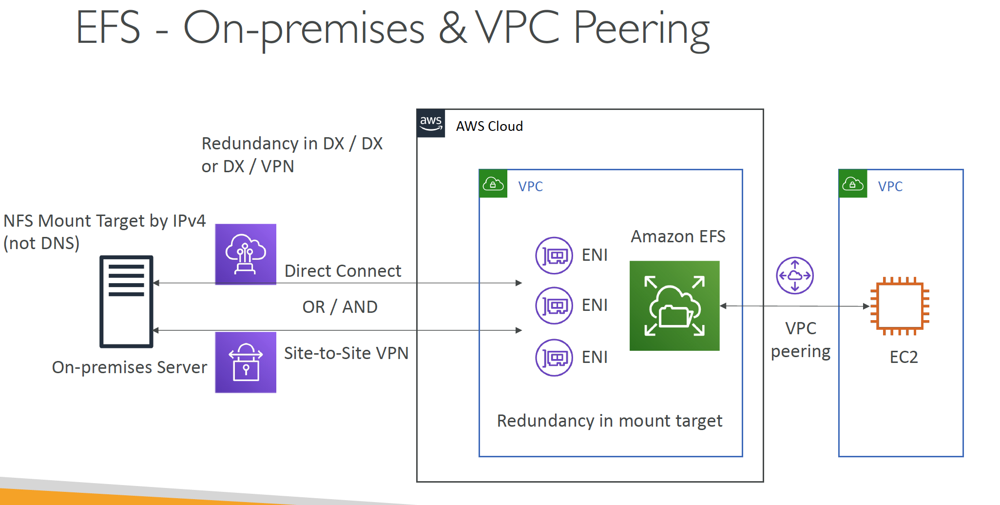
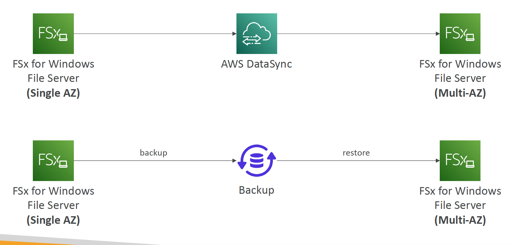
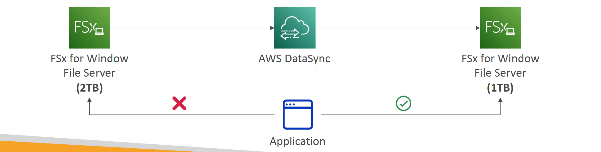

# Section 6: Storage
## Elastic Block Store (EBS)

#### Amazon Data Lifecycle Manager
* Automate the creation, retention, and deletion of EBS snapshots and EBS-backed AMIs
* Schedule backups, cross-account snapshot copies, delete outdated backups, …
* Uses resource tags to identify the resources (EC2 instances, EBS volumes)
* Can’t be used to manage snapshots/AMIs created outside DLM
* Can’t be used to manage instance-store backed AMIs

__Amazon Data Lifecycle Manager vs. AWS Backup__  
* __Use Data Lifecycle Manager__
  - when you want to automate the creation, retention, and deletion of EBS Snapshots
* __Use AWS Backup__  
  - to manage and monitor backups across the AWS services you use, including EBS volumes, from a single place

__EBS Multi-Attach – io1/io2 family__   
* Must use a file system that’s cluster-aware (not XFS, EXT4, etc…)

## Elastic File System (EFS)

#### EFS – Performance & Storage Classes
* __EFS Scale__
  - 1000s of concurrent NFS clients, 10 GB+ /s throughput
  - Grow to Petabyte-scale network file system, automatically
* __Performance Mode (set at EFS creation time)__
  - __General Purpose (default)__ – latency-sensitive use cases (web server, CMS, etc…)
  - __Max I/O__ – higher latency, throughput, highly parallel (big data, media processing)
* __Throughput Mode__
  - __Bursting__ – 1 TB = 50MiB/s + burst of up to 100MiB/s
  - __Provisioned__ – set your throughput regardless of storage size, ex: 1 GiB/s for 1 TB storage
  - __Elastic__ – automatically scales throughput up or down based on your workloads
    * Up to 3GiB/s for reads and 1GiB/s for writes
    * Used for unpredictable workloads

#### EFS – Storage Classes
* __Storage Tiers (lifecycle management feature – move file after N days)__
  - __Standard__: for frequently accessed files
  - __Infrequent access (EFS-IA)__: cost to retrieve files, lower price to store.
  - __Archive__: rarely accessed data (few times each year), 50% cheaper
  - Implement __lifecycle policies__ to move files between storage tiers
* __Availability and durability__  
  - Standard: Multi-AZ, great for prod
  - One Zone: One AZ, great for dev, backup enabled by default, compatible with IA (EFS One Zone-IA)
* Over 90% in cost savings

#### EFS - On-premises & VPC Peering


#### EFS – Access Points
* Easily manage applications access to NFS environments
* Enforce a POSIX user and group to use when accessing the file system
* Restrict access to a directory within the file system and optionally specify a different root directory
* Can restrict access from NFS clients using IAM policies

### EFS – File System Policies
* Resource-based policy to control access to EFS File Systems (same as S3 bucket policy)
* By default, it grants full access to all clients
```json
{
  "Version": "2012-10-17",
  "Description": "Grant Read and Write Access to a specific IAM user",
  "Statement": [
    {
      "Effect": "Allow",
      "Principal": {
        "AWS": "arn:aws:iam::123456789:user/stephane"
      },
      "Action": [
        "elasticfilesystem:ClientMount",
        "elasticfilesystem:ClientWrite"
      ],
      "Condition": {
        "Bool": {
          "aws:SecureTransport": "true"
        }
      }
    }
  ]
}
```

#### EFS – Cross-Region Replication
* Replicate objects in an EFS file system to another AWS Region
* Setup for new or existing EFS file systems
* Provides RPO and RTO of minutes
* Doesn’t affect the provisioned throughput of the EFS file system
* Use cases: meet your compliance and business continuity goals

## S3
__S3 – Replication (Versioning enabled)__  
* __S3 Replication Time Control (S3 RTC)__  
  * Replicates most objects that you upload to Amazon S3 in seconds, and 99.99% of those objects within 15 minutes
  * Helpful for compliance, DR, etc


__S3 Event Notifications with Amazon EventBridge__  
* Advanced filtering options with JSON rules (metadata, object size, name...)
* Multiple Destinations – ex Step Functions, Kinesis Streams / Firehose…
* EventBridge Capabilities – Archive, Replay Events, Reliable delivery

__S3 Performance – S3 Byte-Range Fetches__  
* Parallelize GETs by requesting specific byte ranges
* Better resilience in case of failures
* _Can be used to speed up downloads_
* _Can be used to retrieve only partial data (for example the head of a file)_

__S3 Multi-Part Upload – Remove Incomplete Parts__  
* `aws s3api list-multipart-uploads`
* Use AWS CLI to List Incomplete Multi-part Uploads
* Use Lifecycle Policy to abort & delete Incomplete Multi-part Uploads after X days
```json
{
  "Rules": [
    {
      "ID": "delete-imcomplete-mpu-7days",
      "Status": "Enabled",
      "Filter": {"Prefix": ""},
      "AbortIncompleteMultipartUpload": {
        "DaysAfterInitiation": 7
      }
    }
  ]
}
```

#### S3 – Storage Lens
* Understand, analyze, and optimize storage across entire AWS Organization
* Discover anomalies, identify cost efficiencies, and apply data protection best practices across entire AWS Organization (30 days usage & activity metrics)
* Aggregate data for Organization, specific accounts, regions, buckets, or prefixes
* Default dashboard or create your own dashboards
* Can be configured to export metrics daily to an S3 bucket (CSV, Parquet)

__Storage Lens – Default Dashboard__   
* Visualize summarized insights and trends for both free and advanced metrics
* Default dashboard shows Multi-Region and Multi-Account data
* Preconfigured by Amazon S3
* Can’t be deleted, but can be disabled

#### Storage Lens – Metrics
* __Summary Metrics__  
  - General insights about your S3 storage
  - StorageBytes, ObjectCount…
  - Use cases: identify the fastest-growing (or not used) buckets and prefixes
* __Cost-Optimization Metrics__  
  - Provide insights to manage and optimize your storage costs
  - `NonCurrentVersionStorageBytes`, `IncompleteMultipartUploadStorageBytes`…
  - Use cases: identify buckets with incomplete multipart uploaded older than 7 days, Identify which objects could be transitioned to lower-cost storage class
* __Data-Protection Metrics__
  - Provide insights for data protection features
  - `VersioningEnabledBucketCount`, `MFADeleteEnabledBucketCount`, `SSEKMSEnabledBucketCount`, `CrossRegionReplicationRuleCount`…
  - Use cases: identify buckets that aren’t following data-protection best practices
* __Access-management Metrics__  
  - Provide insights for S3 Object Ownership
  - `ObjectOwnershipBucketOwnerEnforcedBucketCount`…
  - Use cases: identify which Object Ownership settings your buckets use
* __Event Metrics__  
  - Provide insights for S3 Event Notifications
  - `EventNotificationEnabledBucketCount` (identify which buckets have S3 Event Notifications configured)
* __Performance Metrics__  
  - Provide insights for S3 Transfer Acceleration
  - `TransferAccelerationEnabledBucketCount` (identify which buckets have S3 Transfer Acceleration enabled)
* __Activity Metrics__  
  - Provide insights about how your storage is requested
  - `AllRequests`, `GetRequests`, `PutRequests`, `ListRequests`, `BytesDownloaded`…
* __Detailed Status Code Metrics__  
  - Provide insights for HTTP status codes
  - `200OKStatusCount`, `403ForbiddenErrorCount`, `404NotFoundErrorCount`…

__Storage Lens – Free vs. Paid__  
* __Free Metrics__
  - Automatically available for all customers
  - Contains around 28 usage metrics
  - Data is available for queries for 14 days
* __Advanced Metrics and Recommendations__  
  - Additional paid metrics and features
  - __Advanced Metrics__ – Activity, Advanced Cost Optimization, Advanced Data Protection, Status Code
  - __CloudWatch Publishing__ – Access metrics in CloudWatch without additional charges
  - __Prefix Aggregation__ – Collect metrics at the prefix level
  - Data is available for queries for 15 months

## Amazon FSx
__Overview__  
1. FSx for Lustre
2. FSx for Windows File Server
3. FSx for NetApp ONTAP
4. FSx for OpenZFS

#### Amazon FSx for Windows (File Server)
* __FSx for Windows__ is a fully managed Windows file system share drive
* Supports SMB protocol & Windows NTFS
* Microsoft Active Directory integration, ACLs, user quotas
* _Can be mounted on Linux EC2 instances_
* Supports _Microsoft's Distributed File System (DFS) Namespaces_ (group files across multiple FS)
* Scale up to 10s of GB/s, millions of IOPS, 100s PB of data
* Storage Options:
  - __SSD__ – latency sensitive workloads (databases, media processing, data analytics, …)
  - __HDD__ – broad spectrum of workloads (home directory, CMS, …)
* Can be accessed from your on-premises infrastructure (VPN or Direct Connect)
* Can be configured to be Multi-AZ (high availability)
* Data is backed-up daily to S3

#### Amazon FSx for Lustre
* Lustre is a type of parallel distributed file system, for large-scale computing
* The name Lustre is derived from “Linux” and “cluster
* Machine Learning, __High Performance Computing (HPC)__
* Video Processing, Financial Modeling, Electronic Design Automation
* Scales up to 100s GB/s, millions of IOPS, sub-ms latencies
* Storage Options:
  - __SSD__ – low-latency, IOPS intensive workloads, small & random file operations
  - __HDD__ – throughput-intensive workloads, large & sequential file operations
* __Seamless integration with S3__
* Can “read S3” as a file system (through FSx)
* Can write the output of the computations back to S3 (through FSx)
* _Can be used from on-premises servers (VPN or Direct Connect)_

__FSx Lustre - File System Deployment Options__  
* __Scratch File System__  
  - Temporary storage
  - Data is not replicated (doesn’t persist if file server fails)
  - High burst (6x faster, 200MBps per TiB)
  - Usage: short-term processing, optimize costs
* __Persistent File System__  
  - Long-term storage
  - Data is replicated within same AZ
  - Replace failed files within minutes
  - Usage: long-term processing, sensitive data

#### Amazon FSx for NetApp ONTAP
* Managed NetApp ONTAP on AWS
* _File System compatible with NFS, SMB, iSCSI protocol_
* Move workloads running on ONTAP or NAS to AWS
* Works with:
  - Linux
  - Windows
  - MacOS
  - VMware Cloud on AWS
  - Amazon Workspaces & AppStream 2.0
  - Amazon EC2, ECS and EKS
* Storage shrinks or grows automatically
* Snapshots, replication, low-cost, compression and data de-duplication
* _Point-in-time instantaneous cloning (helpful for testing new workloads)_

#### Amazon FSx for OpenZFS
* Managed OpenZFS file system on AWS
* File System compatible with NFS (v3, v4, v4.1, v4.2)
* Move workloads running on ZFS to AWS
* Works with:
  - Linux
  - Windows
  - MacOS
  - VMware Cloud on AWS
  - Amazon Workspaces & AppStream 2.0
  - Amazon EC2, ECS and EKS
* Up to 1,000,000 IOPS with < 0.5ms latency
* Snapshots, compression and low-cost
* _Point-in-time instantaneous cloning (helpful for testing new workloads)_

#### FSx – Solution Architecture Migration from Single AZ to Multi AZ


#### FSx – Solution Architecture Decrease FSx Volume Size
* If you take a backup, you can only restore to a same size
* You can only increase the amount of storage capacity for a file system; you cannot decrease storage capacity.
* Instead, create a new FSx (smaller), use DataSync to sync data and then migrate your app over


#### FSx for Lustre – Data Lazy Loading
* Any data processing job on Lustre with S3 as an input data source can be started without Lustre doing a full download of the dataset first
* Data is lazy loaded: only the data that is actually processed is loaded, meaning you can decrease your costs and latency
* Data is also loaded only once, therefore you reduce your requests on Amazon S3

## AWS DataSync
__Overview__  
* Move large amount of data to and from
  - On-premises / other cloud to AWS (NFS, SMB, HDFS, S3 API…) – _needs agent_
  - AWS to AWS (different storage services) – no agent needed
* Can synchronize to:
  - Amazon S3 (any storage classes – including Glacier)
  - Amazon EFS
  - Amazon FSx (Windows, Lustre, NetApp, OpenZFS...)
* Replication tasks can be scheduled hourly, daily, weekly
* _File permissions and metadata are preserved_ (NFS POSIX, SMB…)
* One agent task can use 10 Gbps, can setup a bandwidth limit

## AWS Data Exchange
__Overview__  
* Find, subscribe to, and use third-party data in the cloud
  - Reuters, who curate data from over 2.2 million unique news stories per year in multiple languages
  - Change Healthcare, who process and anonymize more than 14 billion healthcare transactions and $1 trillion in claims annually
  - Dun & Bradstreet, who maintain a database of more than 330 million global business records;
  - Foursquare, whose location data is derived from 220 million unique consumers and includes more than 60 million global commercial venues.
* Once subscribed to a data product, you can use the AWS Data Exchange API to load data directly into Amazon S3 and then analyze it with a wide variety of AWS analytics and machine learning services

__AWS Data Exchange – Other Products__  
* __AWS Data Exchange for Redshift__
  - Find and subscribe to third-party data in AWS Data Exchange that you can query in an Amazon Redshift data warehouse in minutes
  - Easily license your data in Amazon Redshift through AWS Data Exchange
* __AWS Data Exchange for APIs__  
  - Find and subscribe to third-party APIs with a consistent access using AWS SDKs
  - Consistent AWS-native authentication and governance

## AWS Transfer Family
__Overview__  
* A fully-managed service for file transfers into and out of Amazon S3 or
Amazon EFS using the FTP protocol
* Supported Protocols
  - AWS Transfer for FTP (File Transfer Protocol (FTP))
  - AWS Transfer for FTPS (File Transfer Protocol over SSL (FTPS))
  - AWS Transfer for SFTP (Secure File Transfer Protocol (SFTP))
* Managed infrastructure, Scalable, Reliable, Highly Available (multi-AZ)
* Pay per provisioned endpoint per hour + data transfers in GB
* Store and manage users’ credentials within the service
* Integrate with existing authentication systems (Microsoft Active Directory, LDAP, Okta, Amazon Cognito, custom)
* Usage: sharing files, public datasets, CRM, ERP

#### AWS Transfer Family – Endpoint Types
* __Public Endpoint__  
  - IPs managed by AWS (subject to change, use DNS names)
  - Can’t setup allow lists by
source IP addresses
* __VPC Endpoint with Internal Access__  
  - Static private IPs
  - Setup allow lists (SGs & NACLs)
* __VPC Endpoint with Internet-facing Access__  
  - Static private IPs
  - Static public IPs (EIPs)
  - Setup Security Groups


#### Price of Storage (GB Month)

