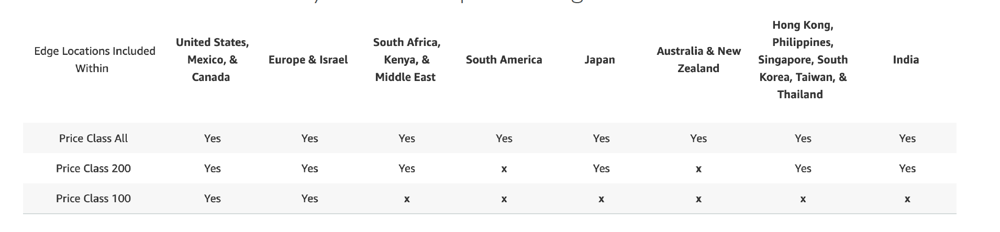
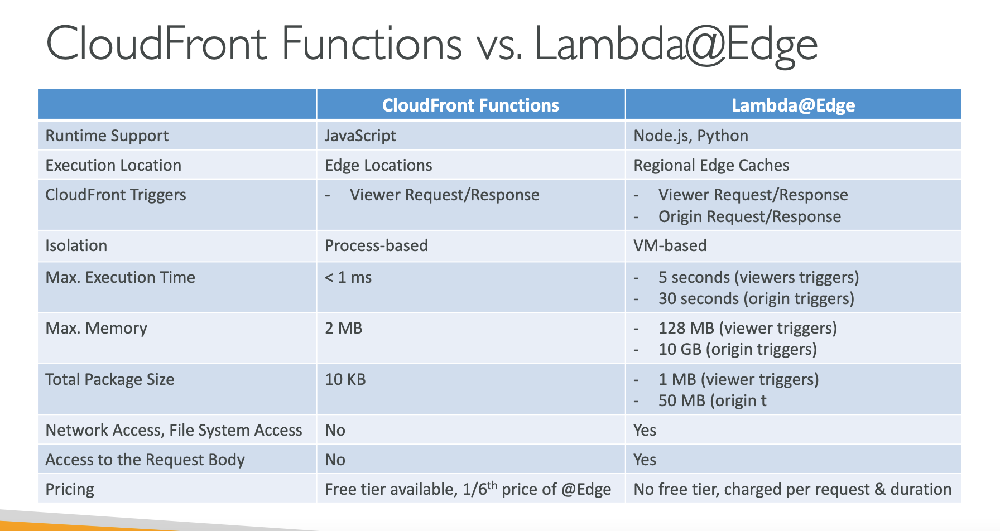
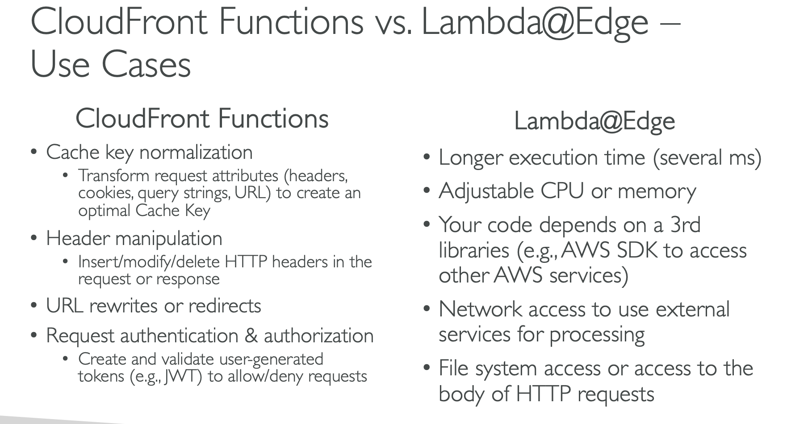

# Section 7: Caching

## CloudFront
#### CloudFront – Origin Groups
* To increase high-availability and do failover
* Origin Group: one primary and one secondary origin
* If the primary origin fails, the second one is used
* Origins can be cross AWS Regions

#### CloudFront Geo Restriction
* Note: the geo header CloudFront-Viewer-Country is in Lambda@Edge

#### CloudFront – Price Classes
* You can reduce the number of edge locations for cost reduction
* Three price classes:
  1. Price Class All: all regions – best performance
  2. Price Class 200: most regions, but excludes the most expensive regions
  3. Price Class 100: only the least expensive regions

#### CloudFront – Custom Error Pages
* Use _Error Caching Minimum TTL_ to specify how long CloudFront caches the custom error pages

#### CloudFront – Customization At The Edge
* __Edge Function:__  
  - CloudFront provides two types: _CloudFront Functions_ & _Lambda@Edge_

__CloudFront – Lambda@Edge__  
* Author your functions in one AWS Region (us-east-1), then CloudFront replicates to its locations

#### CloudFront Functions with Lambda@Edge
* CloudFront Functions and Lambda@Edge can be used together
* NOTE: You can’t combine CloudFront Functions and Lambda@Edge in viewer events (viewer request & viewer response)

#### CloudFront Functions vs. Lambda@Edge

#### CloudFront Functions vs. Lambda@Edge – Use Cases

