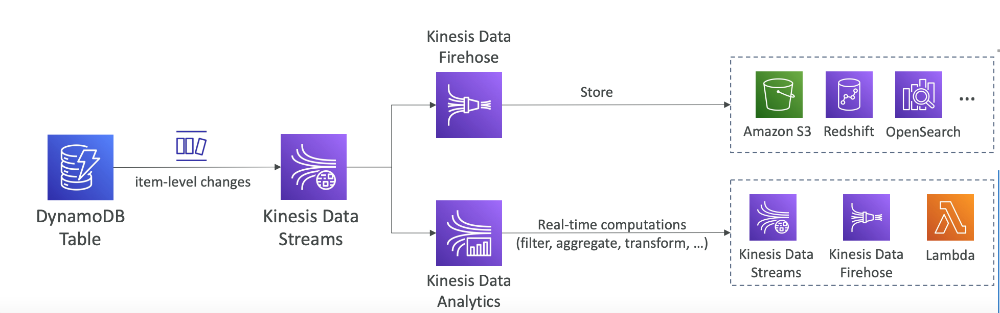
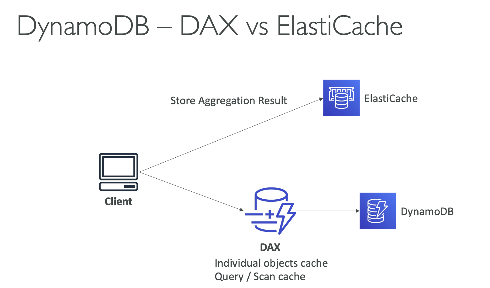
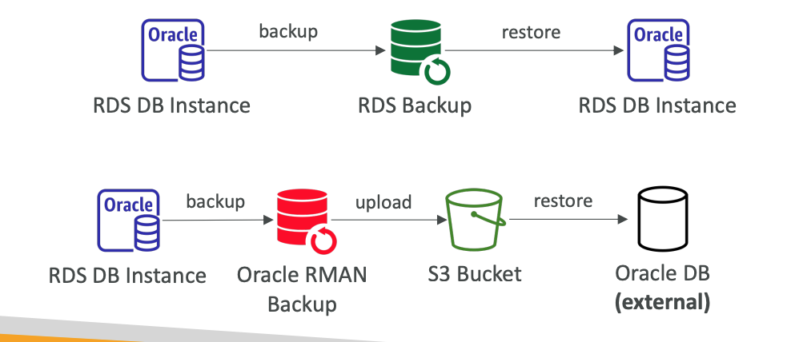
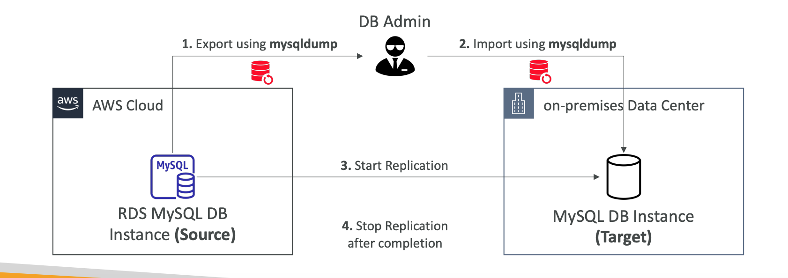
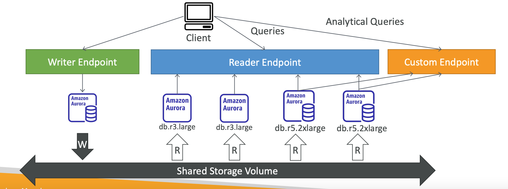

# Section 8: Databases

## DynamoDB
__Overview__  
* Similar to Apache Cassandra (can migrate to DynamoDB)
* Table classes: Standard and Infrequent Access (IA)
* Data types supported are:
  - Scalar Types: String, Number, Binary, Boolean, Null
  - Document Types: List, Map
  - Set Types: String Set, Number Set, Binary Set

__DynamoDB – Indexes__  
* You can only query by PK + sort key on the main table & indexes (≠ RDS)

__Amazon Kinesis Data Streams for DynamoDB__  
* You can use Kinesis Data Streams to capture item-level changes in DynamoDB
* Custom and longer data retention period (> 24 hours in DynamoDB Streams)

__DynamoDB – DAX vs ElastiCache__  

## Amazon OpenSearch
__Amazon OpenSearch (ex ElasticSearch)__  
* _New name is Amazon OpenSearch_
* _ElasticSearch => OpenSearch_
* _Kibana => OpenSearch Dashboards_
* Managed version of OpenSearch (open-source project, fork of ElasticSearch)
* Two modes: Managed cluster or Serverless cluster
* Use cases:
  - Log Analytics
  - Real Time application monitoring
  - Security Analytics
  - Full Text Search
  - Clickstream Analytics
  - Indexing

__OpenSearch + OS Dashboards + Logstash__   
* OpenSearch (like ElasticSearch): provide search and indexing capability
* _OpenSearch Dashboards (like Kibana)_:
  - Provide real-time dashboards on top of the data that sits in OpenSearch
  - Alternative to _CloudWatch dashboards_ (more advanced capabilities)
* _Logstash_:
  - Log ingestion mechanism, use the “Logstash Agent”
  - Alternative to _CloudWatch Logs_ (you decide on retention and granularity)

## Amazon RDS
__RDS – Security (reminder)__  
* _Transparent Data Encryption (TDE)_ for Oracle and SQL Server
* IAM authentication for MySQL, PostgreSQL and MariaDB

__Transparent Data Encryption__  
_Transparent Data Encryption (TDE)_ is a security feature that automatically encrypts data at rest in a database without requiring changes to your application code.  
“Transparent” means:  
* Your app reads/writes data as normal
* Encryption and decryption happen behind the scenes
* Developers don’t have to manually encrypt fields or manage keys in code

__RDS - IAM Authentication__  
* IAM database authentication works with MariaDB, MySQL and PostgreSQL
* You don’t need a password, just an authentication token obtained through IAM & RDS API calls
* Auth token has a lifetime of 15 minutes
* Benefits:
  - Network in/out must be encrypted using SSL
  - IAM to centrally manage users instead of DB
  - Can leverage IAM Roles and EC2 Instance profiles for easy integration

__About RDS for Oracle – Exam Tips__  
Backups
* Use _RDS Backups_ for backups & restore to _Amazon RDS for Oracle_
* Use _Oracle Recovery Manager_ (RMAN) for backups & restore to _non-RDS Oracle instances_

* _Real Application Clusters (RAC)_
  - RDS for Oracle does NOT support RAC
  - RAC is works on Oracle on EC2 Instances because you have full control
* RDS for Oracle supports _Transparent Data Encryption (TDE)_ to encrypt data before it’s written to storage
* DMS works on Oracle RDS

__Oracle Real Application Clusters (RAC)__   _Oracle Real Application Clusters (RAC)_ is an Oracle Database architecture that allows multiple database server instances to run simultaneously against a single shared database, providing _high availability_, _scalability_, and _fault tolerance_.  
In simple terms:
* Many servers, one database, acting as one system.  

__About RDS for MySQL__  
* You can use the native `mysqldump` to migrate a MySQL RDS DB to non-RDS
* The external MySQL database can run either on-premises in your data center, or on an Amazon EC2 instance

__RDS Proxy for AWS Lambda__  
* Supports IAM authentication or DB authentication, auto-scaling
* The Lambda function must have connectivity to the Proxy (public proxy => public Lambda, private proxy => Lambda in VPC)

## Amazon Aurora  
__Aurora Endpoints__  
* Endpoint = Host Address + Port
* __Cluster Endpoint (Writer Endpoint)__
  - Connects to the current primary DB instance in the Aurora cluster
  - Used for all write operations in the DB cluster (inserts, updates, deletes, and queries)
* __Reader Endpoint__
  - Provides load-balancing for read only connections to all Aurora Replicas in the Aurora cluster
  - Used only for read operations (queries)
* __Custom Endpoint__
  - Represents a set on DB instances that you choose in the Aurora cluster
  - Used when you want to connect to different subsets of DB instances with different capacities and configurations (e.g., different DB parameter group)
* __Instance Endpoint__  
  - Connects to a specific DB instance in the Aurora cluster
  - Used when you want to diagnosis and fine tune a specific DB instance

__Aurora – Custom Endpoints__  
* Define a subset of Aurora Instances as a Custom Endpoint
* Example: Run analytical queries on specific replicas
* The Reader Endpoint is generally not used after defining Custom Endpoints

  

__Aurora Logs__  
* You can monitor the following types of Aurora MySQL log files:
  - Error log
  - Slow query log
  - General log
  - The audit log
* These log files are either downloaded or published to CloudWatch Logs
