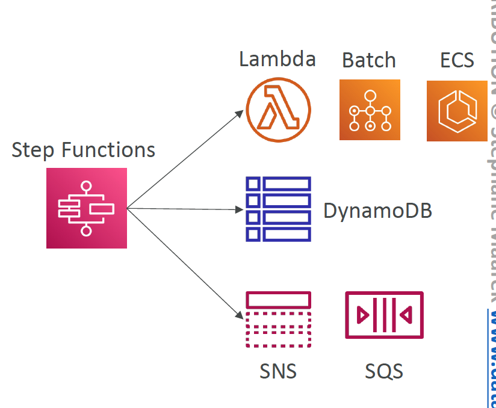
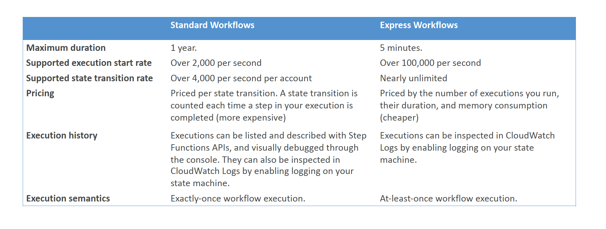
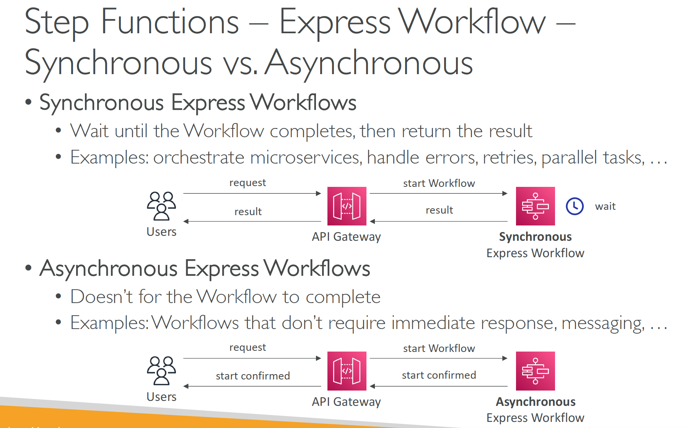

# Section 9: Service Communication
## AWS Step Function
__Introduction__  
* Build serverless visual workflow to orchestrate your Lambda functions
* Represent flow as a JSON _state machine_
* Features: sequence, parallel, conditions, timeouts, error handling…
* Maximum execution time of 1 year
* Possibility to implement human approval feature
* If you chain Lambda functions using Step Functions, be mindful of the added latency to pass the calls.

__Step Function Integrations__  
* __Optimized Integrations__
  - Can invoke a Lambda function
  - Run an AWS Batch job
  - Run an ECS task and wait for it to complete
  - Insert an item from DynamoDB
  - Publish message to SNS, SQS
  - Launch an EMR, Glue, or SageMaker jobs
  - Launch another Step Function workflow…
* __AWS SDK Integrations__  
  - Access 200+ AWS services from your State Machine
  - Works like standard AWS SDK API call

__Step Functions Workflow Triggers__  
* You can invoke a Step Function Workflow (State Machine) using:
  - AWS Management Console
  - AWS SDK (`StartExecution` API call)
  - AWS CLI (`start-execution`)
  - AWS Lambda (`StartExecution` API call)
  - API Gateway
  - EventBridge
  - CodePipeline
  - Step Functions

__Step Functions – Sample Projects__  
https://console.aws.amazon.com/states/home?region=us-east-1#/sample-projects

__Step Functions – Tasks__  
* __Lambda Tasks:__  
  - Invoke a Lambda function
* __Activity Tasks:__  
  - Activity worker (HTTP), EC2 Instances, mobile device, on premise DC
  - They poll the Step functions service
* __Service Tasks:__  
  - Connect to a supported AWS service
  - Lambda function, ECS Task, Fargate, DynamoDB, Batch job, SNS topic, SQS queue
* __Wait Task:__  
  - To wait for a duration or until a timestamp

_Note__: Step Functions does not integrate natively with AWS Mechanical Turk. Use SWF instead

__Step Functions - Standard vs Express__  

__Express Workflow - Sync vs Async__  

__Step Functions – Error Handling__  
* You can enable error handling, retries, and add alerting to Step Function State Machine
* Example: set up EventBridge to alert via email if a State Machine execution fails
